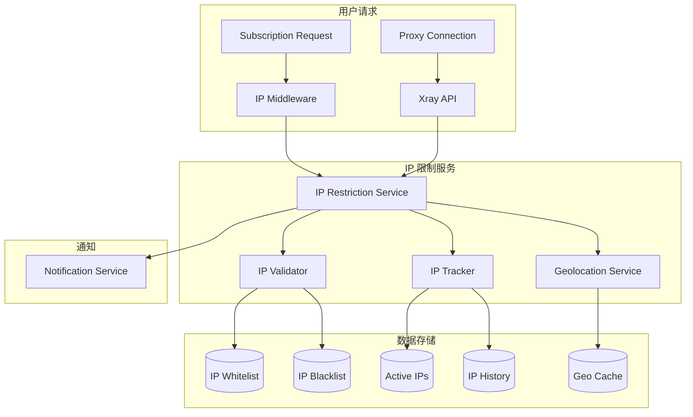

# Design Document: IP Restriction System

## Overview

本设计文档描述 V Panel IP 限制系统的技术架构和实现方案。该系统提供并发 IP 限制、IP 活动追踪、白名单/黑名单管理、地理位置限制等功能，帮助运营者防止账号共享滥用并提升服务安全性。

## Architecture



## Components and Interfaces

### 1. IP Restriction Service

核心服务，协调所有 IP 限制相关功能。

```go
// internal/ip/service.go
type IPRestrictionService interface {
    // 检查 IP 是否允许访问
    CheckAccess(ctx context.Context, userID uint, ip string, accessType AccessType) (*AccessResult, error)
    
    // 记录 IP 活动
    RecordActivity(ctx context.Context, userID uint, ip string, userAgent string, accessType AccessType) error
    
    // 获取用户在线 IP 列表
    GetOnlineIPs(ctx context.Context, userID uint) ([]OnlineIP, error)
    
    // 踢出指定 IP
    KickIP(ctx context.Context, userID uint, ip string) error
    
    // 获取 IP 统计信息
    GetIPStats(ctx context.Context, userID uint) (*IPStats, error)
}

type AccessType string
const (
    AccessTypeSubscription AccessType = "subscription"
    AccessTypeProxy        AccessType = "proxy"
    AccessTypeAPI          AccessType = "api"
)

type AccessResult struct {
    Allowed     bool
    Reason      string
    RemainingSlots int
}
```

### 2. IP Validator

验证 IP 是否在白名单/黑名单中，以及是否符合地理位置限制。

```go
// internal/ip/validator.go
type IPValidator interface {
    // 检查 IP 是否在白名单中
    IsWhitelisted(ctx context.Context, ip string, userID *uint) bool
    
    // 检查 IP 是否在黑名单中
    IsBlacklisted(ctx context.Context, ip string, userID *uint) (*BlacklistEntry, bool)
    
    // 检查 IP 是否符合地理位置限制
    CheckGeoRestriction(ctx context.Context, ip string, planID *uint) (*GeoCheckResult, error)
    
    // 检查 CIDR 范围匹配
    MatchesCIDR(ip string, cidr string) bool
}

type GeoCheckResult struct {
    Allowed     bool
    Country     string
    CountryCode string
    City        string
    Reason      string
}
```

### 3. IP Tracker

追踪用户 IP 活动和在线状态。

```go
// internal/ip/tracker.go
type IPTracker interface {
    // 添加活跃 IP
    AddActiveIP(ctx context.Context, userID uint, ip string, userAgent string) error
    
    // 移除活跃 IP
    RemoveActiveIP(ctx context.Context, userID uint, ip string) error
    
    // 获取活跃 IP 数量
    GetActiveIPCount(ctx context.Context, userID uint) (int, error)
    
    // 清理过期的活跃 IP
    CleanupInactiveIPs(ctx context.Context, timeout time.Duration) (int, error)
    
    // 记录 IP 历史
    RecordIPHistory(ctx context.Context, record *IPRecord) error
    
    // 获取 IP 历史
    GetIPHistory(ctx context.Context, userID uint, filter *IPHistoryFilter) ([]IPRecord, error)
}

type IPRecord struct {
    ID         uint
    UserID     uint
    IP         string
    UserAgent  string
    AccessType AccessType
    Country    string
    City       string
    CreatedAt  time.Time
}
```

### 4. Geolocation Service

IP 地理位置查询服务。

```go
// internal/ip/geolocation.go
type GeolocationService interface {
    // 查询 IP 地理位置
    Lookup(ctx context.Context, ip string) (*GeoInfo, error)
    
    // 批量查询
    LookupBatch(ctx context.Context, ips []string) (map[string]*GeoInfo, error)
}

type GeoInfo struct {
    IP          string
    Country     string
    CountryCode string
    Region      string
    City        string
    Latitude    float64
    Longitude   float64
    ISP         string
    CachedAt    time.Time
}
```

### 5. API Handlers

```go
// internal/api/ip_handler.go

// 管理员接口
// GET /api/admin/ip-restrictions/stats - 获取 IP 限制统计
// GET /api/admin/users/:id/online-ips - 获取用户在线 IP
// POST /api/admin/users/:id/kick-ip - 踢出用户指定 IP
// GET /api/admin/ip-whitelist - 获取白名单
// POST /api/admin/ip-whitelist - 添加白名单
// DELETE /api/admin/ip-whitelist/:id - 删除白名单
// GET /api/admin/ip-blacklist - 获取黑名单
// POST /api/admin/ip-blacklist - 添加黑名单
// DELETE /api/admin/ip-blacklist/:id - 删除黑名单

// 用户接口
// GET /api/user/devices - 获取用户设备列表
// POST /api/user/devices/:ip/kick - 踢出指定设备
```


## Data Models

### IP Whitelist

```go
type IPWhitelist struct {
    ID          uint      `json:"id" gorm:"primaryKey"`
    IP          string    `json:"ip" gorm:"size:45;not null"`           // IPv4 或 IPv6
    CIDR        string    `json:"cidr" gorm:"size:50"`                  // CIDR 范围，如 192.168.1.0/24
    UserID      *uint     `json:"user_id" gorm:"index"`                 // 为空表示全局白名单
    Description string    `json:"description" gorm:"size:255"`
    CreatedBy   uint      `json:"created_by"`
    CreatedAt   time.Time `json:"created_at"`
    UpdatedAt   time.Time `json:"updated_at"`
}
```

### IP Blacklist

```go
type IPBlacklist struct {
    ID          uint       `json:"id" gorm:"primaryKey"`
    IP          string     `json:"ip" gorm:"size:45;not null"`
    CIDR        string     `json:"cidr" gorm:"size:50"`
    UserID      *uint      `json:"user_id" gorm:"index"`                // 为空表示全局黑名单
    Reason      string     `json:"reason" gorm:"size:255"`
    ExpiresAt   *time.Time `json:"expires_at"`                          // 为空表示永久
    IsAutomatic bool       `json:"is_automatic"`                        // 是否自动添加
    CreatedBy   *uint      `json:"created_by"`
    CreatedAt   time.Time  `json:"created_at"`
}
```

### Active IP

```go
type ActiveIP struct {
    ID         uint      `json:"id" gorm:"primaryKey"`
    UserID     uint      `json:"user_id" gorm:"index:idx_user_ip,unique"`
    IP         string    `json:"ip" gorm:"size:45;index:idx_user_ip,unique"`
    UserAgent  string    `json:"user_agent" gorm:"size:500"`
    DeviceType string    `json:"device_type" gorm:"size:50"`            // desktop, mobile, tablet
    Country    string    `json:"country" gorm:"size:100"`
    City       string    `json:"city" gorm:"size:100"`
    LastActive time.Time `json:"last_active" gorm:"index"`
    CreatedAt  time.Time `json:"created_at"`
}
```

### IP History

```go
type IPHistory struct {
    ID         uint       `json:"id" gorm:"primaryKey"`
    UserID     uint       `json:"user_id" gorm:"index:idx_user_time"`
    IP         string     `json:"ip" gorm:"size:45;index"`
    UserAgent  string     `json:"user_agent" gorm:"size:500"`
    AccessType AccessType `json:"access_type" gorm:"size:20"`
    Country    string     `json:"country" gorm:"size:100"`
    City       string     `json:"city" gorm:"size:100"`
    IsSuspicious bool     `json:"is_suspicious"`
    CreatedAt  time.Time  `json:"created_at" gorm:"index:idx_user_time"`
}
```

### Subscription IP Access

```go
type SubscriptionIPAccess struct {
    ID             uint      `json:"id" gorm:"primaryKey"`
    SubscriptionID uint      `json:"subscription_id" gorm:"index:idx_sub_ip,unique"`
    IP             string    `json:"ip" gorm:"size:45;index:idx_sub_ip,unique"`
    UserAgent      string    `json:"user_agent" gorm:"size:500"`
    Country        string    `json:"country" gorm:"size:100"`
    AccessCount    int       `json:"access_count"`
    FirstAccess    time.Time `json:"first_access"`
    LastAccess     time.Time `json:"last_access"`
}
```

### Geo Cache

```go
type GeoCache struct {
    IP          string    `json:"ip" gorm:"primaryKey;size:45"`
    Country     string    `json:"country" gorm:"size:100"`
    CountryCode string    `json:"country_code" gorm:"size:2"`
    Region      string    `json:"region" gorm:"size:100"`
    City        string    `json:"city" gorm:"size:100"`
    Latitude    float64   `json:"latitude"`
    Longitude   float64   `json:"longitude"`
    ISP         string    `json:"isp" gorm:"size:200"`
    CachedAt    time.Time `json:"cached_at" gorm:"index"`
}
```

### IP Restriction Settings

```go
type IPRestrictionSettings struct {
    // 全局设置
    Enabled                bool     `json:"enabled"`
    DefaultMaxConcurrentIPs int     `json:"default_max_concurrent_ips"`  // 默认并发 IP 限制
    InactiveTimeout        int      `json:"inactive_timeout"`            // 不活跃超时（分钟）
    
    // 订阅链接 IP 限制
    SubscriptionIPLimitEnabled bool  `json:"subscription_ip_limit_enabled"`
    DefaultSubscriptionIPLimit int   `json:"default_subscription_ip_limit"`
    
    // 地理位置限制
    GeoRestrictionEnabled  bool     `json:"geo_restriction_enabled"`
    AllowedCountries       []string `json:"allowed_countries"`           // 允许的国家代码
    BlockedCountries       []string `json:"blocked_countries"`           // 阻止的国家代码
    
    // 自动黑名单规则
    AutoBlacklistEnabled   bool     `json:"auto_blacklist_enabled"`
    MaxFailedAttempts      int      `json:"max_failed_attempts"`         // 最大失败次数
    FailedAttemptWindow    int      `json:"failed_attempt_window"`       // 时间窗口（分钟）
    AutoBlacklistDuration  int      `json:"auto_blacklist_duration"`     // 自动黑名单时长（分钟）
}
```

## Correctness Properties

*A property is a characteristic or behavior that should hold true across all valid executions of a system—essentially, a formal statement about what the system should do. Properties serve as the bridge between human-readable specifications and machine-verifiable correctness guarantees.*

### Property 1: Concurrent IP Limit Enforcement

*For any* user with a configured max_concurrent_ips limit (> 0), when the number of active IPs equals the limit, any connection attempt from a new IP should be rejected.

**Validates: Requirements 1.3, 1.4**

### Property 2: Inactive IP Cleanup

*For any* active IP record with last_active timestamp older than the configured inactive_timeout, the IP should be removed from the active count and not count against the concurrent IP limit.

**Validates: Requirements 1.6**

### Property 3: Unlimited IP Option

*For any* user with max_concurrent_ips set to 0 or -1, connection attempts from any number of unique IPs should be allowed without rejection.

**Validates: Requirements 1.8**

### Property 4: IP Activity Recording

*For any* subscription link access or proxy connection, an IP history record should be created containing user_id, ip_address, user_agent, access_type, and timestamp.

**Validates: Requirements 2.1, 2.2, 2.3**

### Property 5: IP Aggregation Accuracy

*For any* set of IP history records for a user within a time period, the unique IP count aggregation should equal the count of distinct IP addresses in that set.

**Validates: Requirements 2.4**

### Property 6: Suspicious Pattern Detection

*For any* user with IP accesses from more than N different countries within M minutes (configurable thresholds), the system should flag the activity as suspicious.

**Validates: Requirements 2.8**

### Property 7: Device Kick Temporary Block

*For any* IP that is kicked by a user, that IP should be added to a temporary block list and subsequent connection attempts from that IP should be rejected until the block expires.

**Validates: Requirements 3.4**

### Property 8: Remaining Slots Calculation

*For any* user, the remaining available device slots should equal max_concurrent_ips minus the current active IP count.

**Validates: Requirements 3.5**

### Property 9: CIDR Range Matching

*For any* IP address and CIDR range in whitelist/blacklist, the IP should match if and only if it falls within the network range defined by the CIDR notation.

**Validates: Requirements 4.2, 5.2**

### Property 10: Whitelist Bypass

*For any* IP that matches a whitelist entry (global or user-specific), concurrent IP limit checks should be bypassed and access should be allowed regardless of current active IP count.

**Validates: Requirements 4.3**

### Property 11: Whitelist Access Logging

*For any* access from a whitelisted IP, an IP history record should still be created for audit purposes.

**Validates: Requirements 4.7**

### Property 12: Blacklist Rejection

*For any* IP that matches a blacklist entry (global or user-specific) that has not expired, access should be rejected with 403 status.

**Validates: Requirements 5.3**

### Property 13: Temporary Blacklist Expiration

*For any* blacklist entry with an expires_at timestamp in the past, the entry should no longer block access from that IP.

**Validates: Requirements 5.5**

### Property 14: Auto-Blacklist Trigger

*For any* IP that exceeds the configured max_failed_attempts within the failed_attempt_window, the IP should be automatically added to the blacklist with the configured auto_blacklist_duration.

**Validates: Requirements 5.4**

### Property 15: Subscription IP Limit

*For any* subscription link with IP limit enabled, when the number of unique IPs that have accessed the link equals the limit, access from a new IP should be rejected with 403 status.

**Validates: Requirements 6.3, 6.4**

### Property 16: Geo Restriction Enforcement

*For any* access attempt when geo restriction is enabled, if the IP's country is in the blocked_countries list or not in the allowed_countries list (when specified), access should be rejected.

**Validates: Requirements 7.2, 7.3**

### Property 17: Geolocation Cache

*For any* IP that has been looked up within the cache TTL period, subsequent lookups should return the cached result without making external API calls.

**Validates: Requirements 7.6**


## Error Handling

### Error Codes

```go
const (
    ErrIPLimitExceeded       = "IP_LIMIT_EXCEEDED"        // 并发 IP 超限
    ErrIPBlacklisted         = "IP_BLACKLISTED"           // IP 在黑名单中
    ErrGeoRestricted         = "GEO_RESTRICTED"           // 地理位置受限
    ErrSubscriptionIPLimit   = "SUBSCRIPTION_IP_LIMIT"    // 订阅链接 IP 超限
    ErrIPKickFailed          = "IP_KICK_FAILED"           // 踢出 IP 失败
    ErrInvalidCIDR           = "INVALID_CIDR"             // 无效的 CIDR 格式
    ErrGeolocationFailed     = "GEOLOCATION_FAILED"       // 地理位置查询失败
)
```

### Error Responses

```json
// IP 限制超限
{
    "code": "IP_LIMIT_EXCEEDED",
    "message": "已达到最大设备数限制，请断开其他设备后重试",
    "details": {
        "max_devices": 3,
        "current_devices": 3,
        "online_ips": ["192.168.1.1", "192.168.1.2", "192.168.1.3"]
    }
}

// IP 黑名单
{
    "code": "IP_BLACKLISTED",
    "message": "您的 IP 地址已被限制访问",
    "details": {
        "reason": "多次失败尝试",
        "expires_at": "2026-01-15T10:00:00Z"
    }
}

// 地理位置限制
{
    "code": "GEO_RESTRICTED",
    "message": "您所在的地区暂不支持访问",
    "details": {
        "country": "XX",
        "country_name": "Unknown Country"
    }
}
```

## Testing Strategy

### Unit Tests

1. **CIDR Matching Tests**
   - Test IPv4 CIDR matching
   - Test IPv6 CIDR matching
   - Test edge cases (single IP, /32, /128)

2. **IP Validation Tests**
   - Test whitelist checking
   - Test blacklist checking with expiration
   - Test priority (whitelist > blacklist)

3. **Concurrent IP Tracking Tests**
   - Test adding/removing active IPs
   - Test inactive cleanup
   - Test limit enforcement

### Property-Based Tests

使用 Go 的 `testing/quick` 或 `gopter` 库进行属性测试：

1. **Property 1 & 2**: Concurrent IP limit and cleanup
   - Generate random users with different limits
   - Generate random IP connection sequences
   - Verify limit enforcement and cleanup behavior

2. **Property 9**: CIDR matching
   - Generate random IP addresses and CIDR ranges
   - Verify matching correctness against reference implementation

3. **Property 15**: Subscription IP limit
   - Generate random subscription access patterns
   - Verify limit enforcement

### Integration Tests

1. **End-to-End IP Restriction Flow**
   - Test complete flow from request to response
   - Test with real database

2. **Geolocation Integration**
   - Test with mock geolocation service
   - Test cache behavior

## Implementation Notes

### Performance Considerations

1. **Active IP Tracking**: 使用 Redis 存储活跃 IP，支持快速查询和自动过期
2. **Geolocation Cache**: 缓存地理位置查询结果，减少外部 API 调用
3. **Batch Operations**: 支持批量导入/导出白名单和黑名单
4. **Index Optimization**: 在 IP 和 user_id 字段上创建适当索引

### Security Considerations

1. **IP Spoofing**: 使用 X-Forwarded-For 时验证可信代理
2. **Rate Limiting**: 对 IP 相关 API 实施速率限制
3. **Audit Logging**: 记录所有 IP 限制相关操作

### Geolocation Provider

推荐使用 MaxMind GeoLite2 数据库：
- 免费版本满足基本需求
- 支持本地查询，无需外部 API 调用
- 定期更新数据库（每周）
