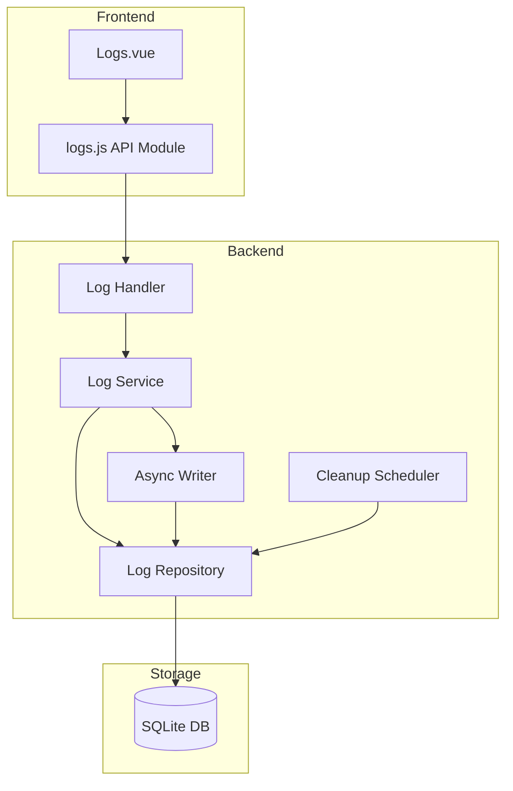

# Design Document: Logging System

## Overview

本设计文档描述 V Panel 日志记录系统的技术实现方案。该系统扩展现有的 logger 包，增加数据库持久化能力，提供 RESTful API 和 Web 管理界面。

系统采用分层架构：
- **Repository 层**: 数据库操作（已有 Log 模型，需扩展 Repository）
- **Service 层**: 业务逻辑，包括异步写入、批量处理、清理调度
- **Handler 层**: HTTP API 处理
- **Frontend 层**: Vue.js 管理界面

## Architecture



## Components and Interfaces

### 1. Log Repository (`internal/database/repository/log_repository.go`)

扩展现有的 repository 模式，提供日志数据访问接口。

```go
// LogRepository defines the interface for log data access
type LogRepository interface {
    // Create creates a single log entry
    Create(ctx context.Context, log *Log) error
    
    // CreateBatch creates multiple log entries in a single transaction
    CreateBatch(ctx context.Context, logs []*Log) error
    
    // GetByID retrieves a log entry by ID
    GetByID(ctx context.Context, id int64) (*Log, error)
    
    // List retrieves logs with pagination
    List(ctx context.Context, filter *LogFilter, limit, offset int) ([]*Log, error)
    
    // Count returns the total count of logs matching the filter
    Count(ctx context.Context, filter *LogFilter) (int64, error)
    
    // DeleteOlderThan deletes logs older than the specified time
    DeleteOlderThan(ctx context.Context, before time.Time) (int64, error)
    
    // DeleteByFilter deletes logs matching the filter
    DeleteByFilter(ctx context.Context, filter *LogFilter) (int64, error)
}

// LogFilter defines filtering options for log queries
type LogFilter struct {
    Level       string     // Filter by log level (debug, info, warn, error, fatal)
    MinLevel    string     // Filter by minimum log level
    Source      string     // Filter by source component
    UserID      *int64     // Filter by user ID
    StartTime   *time.Time // Filter by start time
    EndTime     *time.Time // Filter by end time
    Keyword     string     // Search keyword in message
    RequestID   string     // Filter by request ID
}
```

### 2. Log Service (`internal/log/service.go`)

提供日志业务逻辑，包括异步写入和清理调度。

```go
// LogService defines the interface for log operations
type LogService interface {
    // Log writes a log entry asynchronously
    Log(ctx context.Context, entry *LogEntry) error
    
    // LogSync writes a log entry synchronously (for critical logs)
    LogSync(ctx context.Context, entry *LogEntry) error
    
    // Query retrieves logs with filtering and pagination
    Query(ctx context.Context, filter *LogFilter, page, pageSize int) (*LogQueryResult, error)
    
    // GetByID retrieves a single log entry
    GetByID(ctx context.Context, id int64) (*LogEntry, error)
    
    // Delete deletes logs matching the filter
    Delete(ctx context.Context, filter *LogFilter) (int64, error)
    
    // Cleanup removes logs older than retention period
    Cleanup(ctx context.Context) (int64, error)
    
    // StartCleanupScheduler starts the automatic cleanup scheduler
    StartCleanupScheduler(ctx context.Context)
    
    // StopCleanupScheduler stops the cleanup scheduler
    StopCleanupScheduler()
    
    // Flush flushes any buffered logs to the database
    Flush() error
    
    // Close closes the service and flushes remaining logs
    Close() error
}

// LogEntry represents a log entry for the service layer
type LogEntry struct {
    Level     string
    Message   string
    Source    string
    UserID    *int64
    IP        string
    UserAgent string
    RequestID string
    Fields    map[string]interface{}
}

// LogQueryResult represents paginated query results
type LogQueryResult struct {
    Logs       []*LogEntry
    Total      int64
    Page       int
    PageSize   int
    TotalPages int
}
```

### 3. Async Writer (`internal/log/async_writer.go`)

异步日志写入器，使用缓冲区和批量写入优化性能。

```go
// AsyncWriter handles asynchronous log writing
type AsyncWriter struct {
    repo       LogRepository
    buffer     chan *Log
    batchSize  int
    flushInterval time.Duration
    done       chan struct{}
    wg         sync.WaitGroup
}

// NewAsyncWriter creates a new async writer
func NewAsyncWriter(repo LogRepository, bufferSize, batchSize int, flushInterval time.Duration) *AsyncWriter

// Write adds a log entry to the buffer
func (w *AsyncWriter) Write(log *Log) error

// Flush flushes all buffered logs to the database
func (w *AsyncWriter) Flush() error

// Close stops the writer and flushes remaining logs
func (w *AsyncWriter) Close() error
```

### 4. Log Handler (`internal/api/handlers/logs.go`)

HTTP API 处理器。

```go
// LogHandler handles log-related HTTP requests
type LogHandler struct {
    service LogService
    logger  logger.Logger
}

// Routes:
// GET    /api/logs          - List logs with filtering
// GET    /api/logs/:id      - Get log by ID
// DELETE /api/logs          - Delete logs by filter
// POST   /api/logs/cleanup  - Trigger manual cleanup
// GET    /api/logs/export   - Export logs as JSON/CSV
```

### 5. Log Configuration

扩展现有配置结构。

```go
// LogConfig extended configuration
type LogConfig struct {
    Level           string        `yaml:"level" env:"V_LOG_LEVEL" default:"info"`
    Format          string        `yaml:"format" env:"V_LOG_FORMAT" default:"json"`
    Output          string        `yaml:"output" env:"V_LOG_OUTPUT" default:"stdout"`
    // New fields for database logging
    DatabaseEnabled bool          `yaml:"database_enabled" env:"V_LOG_DB_ENABLED" default:"true"`
    DatabaseLevel   string        `yaml:"database_level" env:"V_LOG_DB_LEVEL" default:"info"`
    RetentionDays   int           `yaml:"retention_days" env:"V_LOG_RETENTION_DAYS" default:"30"`
    BufferSize      int           `yaml:"buffer_size" env:"V_LOG_BUFFER_SIZE" default:"1000"`
    BatchSize       int           `yaml:"batch_size" env:"V_LOG_BATCH_SIZE" default:"100"`
    FlushInterval   time.Duration `yaml:"flush_interval" env:"V_LOG_FLUSH_INTERVAL" default:"5s"`
}
```

## Data Models

### Log Model (扩展现有模型)

```go
// Log represents a system log entry (in internal/database/models.go)
type Log struct {
    ID        int64     `json:"id" gorm:"primaryKey"`
    Level     string    `json:"level" gorm:"size:10;index"`
    Message   string    `json:"message" gorm:"type:text"`
    Source    string    `json:"source" gorm:"size:50;index"`
    UserID    *int64    `json:"user_id" gorm:"index"`
    IP        string    `json:"ip" gorm:"size:50"`
    UserAgent string    `json:"user_agent" gorm:"size:255"`
    RequestID string    `json:"request_id" gorm:"size:100;index"`
    Fields    string    `json:"fields" gorm:"type:text"` // JSON encoded extra fields
    CreatedAt time.Time `json:"created_at" gorm:"index"`
}
```

### Database Migration

```sql
-- Migration: 008_logs_enhancement.sql
-- Enhance logs table with additional indexes and fields

-- Add request_id column if not exists
ALTER TABLE logs ADD COLUMN IF NOT EXISTS request_id VARCHAR(100);

-- Add fields column for extra context
ALTER TABLE logs ADD COLUMN IF NOT EXISTS fields TEXT;

-- Create composite indexes for common queries
CREATE INDEX IF NOT EXISTS idx_logs_level_created ON logs(level, created_at);
CREATE INDEX IF NOT EXISTS idx_logs_source_created ON logs(source, created_at);
CREATE INDEX IF NOT EXISTS idx_logs_user_created ON logs(user_id, created_at);
CREATE INDEX IF NOT EXISTS idx_logs_request_id ON logs(request_id);

-- Create index for full-text search on message (SQLite FTS)
-- Note: For production, consider using FTS5 virtual table
CREATE INDEX IF NOT EXISTS idx_logs_message ON logs(message);
```

### API Response Models

```typescript
// Frontend types (web/src/types/logs.ts)
interface LogEntry {
    id: number;
    level: string;
    message: string;
    source: string;
    user_id?: number;
    ip?: string;
    user_agent?: string;
    request_id?: string;
    fields?: Record<string, any>;
    created_at: string;
}

interface LogQueryParams {
    page?: number;
    page_size?: number;
    level?: string;
    min_level?: string;
    source?: string;
    user_id?: number;
    start_time?: string;
    end_time?: string;
    keyword?: string;
    request_id?: string;
}

interface LogQueryResponse {
    logs: LogEntry[];
    total: number;
    page: number;
    page_size: number;
    total_pages: number;
}
```


## Correctness Properties

*A property is a characteristic or behavior that should hold true across all valid executions of a system—essentially, a formal statement about what the system should do. Properties serve as the bridge between human-readable specifications and machine-verifiable correctness guarantees.*

### Property 1: Log Persistence Completeness

*For any* log entry with level, message, source, and optional context fields (user_id, ip, user_agent), when persisted through the Log_Service, the stored entry SHALL contain all provided fields with correct values.

**Validates: Requirements 1.1, 1.2**

### Property 2: Batch Insertion Integrity

*For any* batch of N log entries submitted to CreateBatch, exactly N entries SHALL be persisted to the database, and each entry SHALL be retrievable with its original data intact.

**Validates: Requirements 1.4**

### Property 3: Unique Identifier Generation

*For any* set of log entries created through the Log_Service, each entry SHALL have a unique identifier, and no two entries SHALL share the same ID.

**Validates: Requirements 1.5**

### Property 4: Pagination Correctness

*For any* log query with page P and page_size S, the result SHALL contain at most S entries, and the entries SHALL be from position (P-1)*S to P*S-1 in the ordered result set.

**Validates: Requirements 2.1**

### Property 5: Filter Correctness

*For any* log query with filters (level, date range, source, keyword), all returned entries SHALL match ALL specified filter criteria, and no entry matching all criteria SHALL be excluded.

**Validates: Requirements 2.2, 2.3, 2.4, 2.5**

### Property 6: Export Format Validity

*For any* log export request, the generated output SHALL be valid JSON (when format=json) or valid CSV (when format=csv), and SHALL contain all log entries matching the filter criteria.

**Validates: Requirements 3.5**

### Property 7: Retention-Based Cleanup

*For any* cleanup operation with retention period R days, all logs with created_at older than R days SHALL be deleted, and no logs newer than R days SHALL be deleted.

**Validates: Requirements 4.2**

### Property 8: Manual Cleanup Filter Accuracy

*For any* manual cleanup request with filter criteria, exactly the logs matching the filter SHALL be deleted, and the returned count SHALL equal the number of deleted entries.

**Validates: Requirements 4.3**

### Property 9: Database Level Filtering

*For any* log entry with level L, when database_level is configured to M, the entry SHALL be persisted to database if and only if severity(L) >= severity(M).

**Validates: Requirements 5.1**

### Property 10: Async Non-Blocking Writes

*For any* call to Log(), the method SHALL return within a bounded time T (e.g., 1ms) regardless of database write latency, and the log SHALL eventually be persisted.

**Validates: Requirements 6.1**

### Property 11: Batch Writing Efficiency

*For any* sequence of N log entries written within the flush interval, they SHALL be persisted in ceil(N/batch_size) database transactions or fewer.

**Validates: Requirements 6.2**

### Property 12: Query Result Limits

*For any* log query, the number of returned entries SHALL NOT exceed the configured maximum limit (default 1000), even if more entries match the filter.

**Validates: Requirements 6.5**

## Error Handling

### Database Errors

1. **Connection Failure**: When database is unavailable, Log_Service falls back to console/file logging
2. **Write Failure**: Failed batch writes are retried up to 3 times with exponential backoff
3. **Query Timeout**: Queries exceeding 30 seconds are cancelled and return a timeout error

### API Errors

| Error Code | HTTP Status | Description |
|------------|-------------|-------------|
| LOG_NOT_FOUND | 404 | Log entry with specified ID not found |
| INVALID_FILTER | 400 | Invalid filter parameters |
| INVALID_DATE_RANGE | 400 | End date before start date |
| UNAUTHORIZED | 401 | Authentication required |
| FORBIDDEN | 403 | Insufficient permissions |
| EXPORT_TOO_LARGE | 400 | Export request exceeds maximum size |

### Graceful Degradation

- If async writer buffer is full, logs are written synchronously
- If database is slow, batch size is automatically reduced
- If cleanup fails, it's retried in the next scheduled run

## Testing Strategy

### Unit Tests

Unit tests verify specific examples and edge cases:

1. **Repository Tests**: Test CRUD operations, filtering, pagination
2. **Service Tests**: Test business logic, async writing, cleanup scheduling
3. **Handler Tests**: Test HTTP request/response handling, validation
4. **Config Tests**: Test configuration loading and validation

### Property-Based Tests

Property-based tests verify universal properties across all inputs using Go's `testing/quick` package or `gopter`:

1. **Property 1-3**: Test log persistence with randomly generated log entries
2. **Property 4-5**: Test query operations with random filters and pagination
3. **Property 6**: Test export with random log data
4. **Property 7-8**: Test cleanup with random timestamps and filters
5. **Property 9**: Test level filtering with all level combinations
6. **Property 10-11**: Test async behavior with concurrent writes
7. **Property 12**: Test query limits with large datasets

### Integration Tests

1. **End-to-End API Tests**: Test complete request/response cycles
2. **Database Migration Tests**: Verify schema changes work correctly
3. **Cleanup Scheduler Tests**: Test scheduled cleanup execution

### Test Configuration

- Property tests: Minimum 100 iterations per property
- Use `gopter` library for property-based testing in Go
- Tag format: **Feature: logging-system, Property N: {property_text}**
