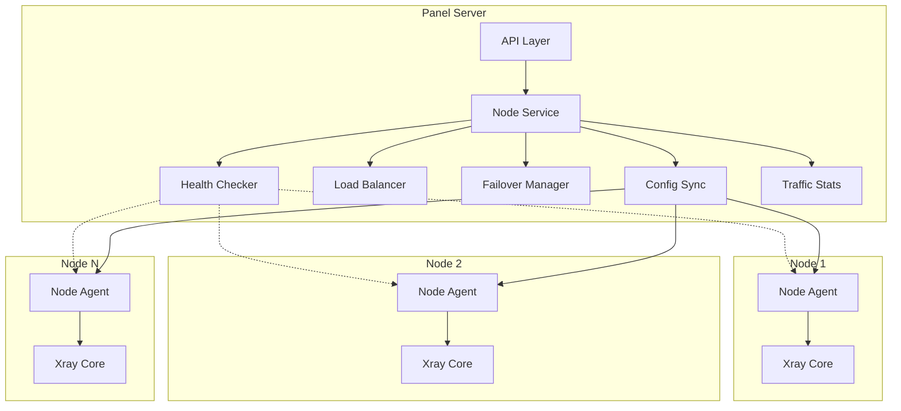
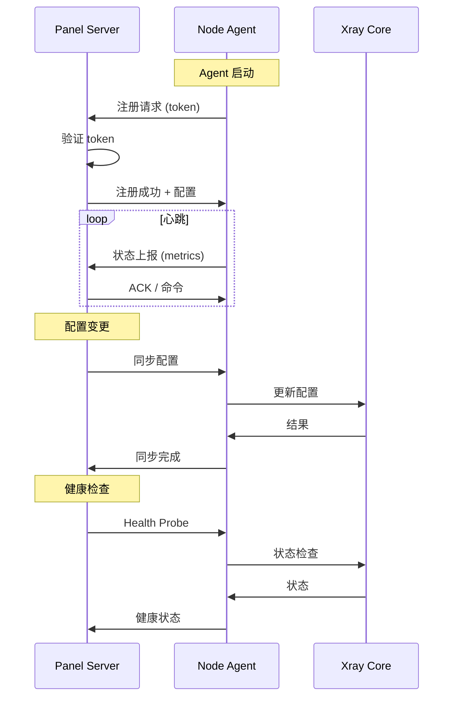

# Design Document: Multi-Server Management System

## Overview

多服务器管理系统为 V Panel 提供分布式节点管理能力，支持管理多个 Xray 节点服务器。系统采用主控-代理架构，Panel Server 作为中央控制器，Node Agent 部署在各节点上执行命令和上报状态。

核心功能包括：
- 节点注册与生命周期管理
- 健康检查与故障检测
- 负载均衡与用户分配
- 自动故障转移
- 配置同步
- 流量统计聚合

## Architecture



### 通信架构



## Components and Interfaces

### 1. Node Model

```go
// Node 表示一个远程 Xray 节点
type Node struct {
    ID          int64     `json:"id" gorm:"primaryKey"`
    Name        string    `json:"name" gorm:"size:128;not null"`
    Address     string    `json:"address" gorm:"size:256;not null"` // IP 或域名
    Port        int       `json:"port" gorm:"default:8443"`         // Agent 端口
    Token       string    `json:"-" gorm:"size:64;uniqueIndex"`     // 认证令牌
    Status      string    `json:"status" gorm:"size:32;default:offline"` // online, offline, unhealthy
    Tags        string    `json:"tags" gorm:"type:text"`            // JSON 数组
    Region      string    `json:"region" gorm:"size:64"`
    Weight      int       `json:"weight" gorm:"default:1"`          // 负载均衡权重
    MaxUsers    int       `json:"max_users" gorm:"default:0"`       // 0 = 无限制
    CurrentUsers int      `json:"current_users" gorm:"default:0"`
    Latency     int       `json:"latency" gorm:"default:0"`         // 毫秒
    LastSeenAt  *time.Time `json:"last_seen_at"`
    SyncStatus  string    `json:"sync_status" gorm:"size:32;default:pending"` // synced, pending, failed
    SyncedAt    *time.Time `json:"synced_at"`
    CreatedAt   time.Time `json:"created_at"`
    UpdatedAt   time.Time `json:"updated_at"`
}

// NodeStatus 常量
const (
    NodeStatusOnline    = "online"
    NodeStatusOffline   = "offline"
    NodeStatusUnhealthy = "unhealthy"
)
```

### 2. Node Group Model

```go
// NodeGroup 表示节点分组
type NodeGroup struct {
    ID          int64     `json:"id" gorm:"primaryKey"`
    Name        string    `json:"name" gorm:"size:64;not null"`
    Description string    `json:"description" gorm:"size:256"`
    Region      string    `json:"region" gorm:"size:64"`
    Strategy    string    `json:"strategy" gorm:"size:32;default:round-robin"` // 负载均衡策略
    CreatedAt   time.Time `json:"created_at"`
    UpdatedAt   time.Time `json:"updated_at"`
}

// NodeGroupMember 节点-分组关联
type NodeGroupMember struct {
    ID        int64     `json:"id" gorm:"primaryKey"`
    NodeID    int64     `json:"node_id" gorm:"index;not null"`
    GroupID   int64     `json:"group_id" gorm:"index;not null"`
    CreatedAt time.Time `json:"created_at"`
}
```

### 3. Health Check Model

```go
// HealthCheck 健康检查记录
type HealthCheck struct {
    ID        int64     `json:"id" gorm:"primaryKey"`
    NodeID    int64     `json:"node_id" gorm:"index;not null"`
    Status    string    `json:"status" gorm:"size:32"` // success, failed
    Latency   int       `json:"latency"`               // 毫秒
    Message   string    `json:"message" gorm:"size:512"`
    CheckedAt time.Time `json:"checked_at" gorm:"index"`
}
```

### 4. User-Node Assignment Model

```go
// UserNodeAssignment 用户-节点分配
type UserNodeAssignment struct {
    ID        int64     `json:"id" gorm:"primaryKey"`
    UserID    int64     `json:"user_id" gorm:"uniqueIndex;not null"`
    NodeID    int64     `json:"node_id" gorm:"index;not null"`
    AssignedAt time.Time `json:"assigned_at"`
    UpdatedAt time.Time `json:"updated_at"`
}
```

### 5. Node Service Interface

```go
// NodeService 节点管理服务接口
type NodeService interface {
    // 节点 CRUD
    Create(ctx context.Context, node *Node) error
    Update(ctx context.Context, node *Node) error
    Delete(ctx context.Context, id int64) error
    GetByID(ctx context.Context, id int64) (*Node, error)
    List(ctx context.Context, filter *NodeFilter) ([]*Node, error)
    
    // 节点状态
    UpdateStatus(ctx context.Context, id int64, status string) error
    UpdateMetrics(ctx context.Context, id int64, metrics *NodeMetrics) error
    
    // Token 管理
    GenerateToken(ctx context.Context, nodeID int64) (string, error)
    RotateToken(ctx context.Context, nodeID int64) (string, error)
    RevokeToken(ctx context.Context, nodeID int64) error
    ValidateToken(ctx context.Context, token string) (*Node, error)
}
```

### 6. Health Checker Interface

```go
// HealthChecker 健康检查服务接口
type HealthChecker interface {
    // 启动/停止检查
    Start(ctx context.Context) error
    Stop(ctx context.Context) error
    
    // 手动检查
    CheckNode(ctx context.Context, nodeID int64) (*HealthCheckResult, error)
    CheckAll(ctx context.Context) ([]*HealthCheckResult, error)
    
    // 查询历史
    GetHistory(ctx context.Context, nodeID int64, limit int) ([]*HealthCheck, error)
}

// HealthCheckResult 检查结果
type HealthCheckResult struct {
    NodeID      int64
    Status      string // healthy, unhealthy
    TCPOk       bool
    APIok       bool
    XrayOk      bool
    Latency     int
    Message     string
    CheckedAt   time.Time
}
```

### 7. Load Balancer Interface

```go
// LoadBalancer 负载均衡器接口
type LoadBalancer interface {
    // 选择节点
    SelectNode(ctx context.Context, userID int64, opts *SelectOptions) (*Node, error)
    SelectNodes(ctx context.Context, userID int64, count int, opts *SelectOptions) ([]*Node, error)
    
    // 用户分配
    AssignUser(ctx context.Context, userID int64, nodeID int64) error
    UnassignUser(ctx context.Context, userID int64) error
    GetUserNode(ctx context.Context, userID int64) (*Node, error)
    
    // 重新平衡
    Rebalance(ctx context.Context, groupID int64) error
}

// SelectOptions 选择选项
type SelectOptions struct {
    Strategy    string   // round-robin, least-connections, weighted, geographic
    GroupID     *int64   // 限定分组
    ExcludeIDs  []int64  // 排除节点
    UserIP      string   // 用户 IP（地理位置策略）
    Sticky      bool     // 是否保持亲和性
}

// BalanceStrategy 负载均衡策略
const (
    StrategyRoundRobin       = "round-robin"
    StrategyLeastConnections = "least-connections"
    StrategyWeighted         = "weighted"
    StrategyGeographic       = "geographic"
)
```

### 8. Failover Manager Interface

```go
// FailoverManager 故障转移管理器接口
type FailoverManager interface {
    // 触发故障转移
    TriggerFailover(ctx context.Context, nodeID int64) error
    
    // 恢复
    TriggerRecovery(ctx context.Context, nodeID int64) error
    
    // 配置
    SetThreshold(threshold int) // 连续失败次数阈值
    SetMaxConcurrent(max int)   // 最大并发迁移数
}
```

### 9. Config Sync Interface

```go
// ConfigSync 配置同步服务接口
type ConfigSync interface {
    // 同步操作
    SyncToNode(ctx context.Context, nodeID int64) error
    SyncToGroup(ctx context.Context, groupID int64) error
    SyncToAll(ctx context.Context) error
    
    // 状态查询
    GetSyncStatus(ctx context.Context, nodeID int64) (*SyncStatus, error)
    
    // 配置验证
    ValidateConfig(ctx context.Context, config []byte) error
}
```

### 10. Node Agent Interface (gRPC)

```protobuf
service NodeAgent {
    // 注册
    rpc Register(RegisterRequest) returns (RegisterResponse);
    
    // 心跳
    rpc Heartbeat(HeartbeatRequest) returns (HeartbeatResponse);
    
    // 命令执行
    rpc ExecuteCommand(CommandRequest) returns (CommandResponse);
    
    // 配置同步
    rpc SyncConfig(SyncConfigRequest) returns (SyncConfigResponse);
    
    // 健康检查
    rpc HealthCheck(HealthCheckRequest) returns (HealthCheckResponse);
    
    // 指标上报
    rpc ReportMetrics(MetricsRequest) returns (MetricsResponse);
}
```

## Data Models

### 数据库表结构

```sql
-- 节点表
CREATE TABLE nodes (
    id BIGINT PRIMARY KEY AUTO_INCREMENT,
    name VARCHAR(128) NOT NULL,
    address VARCHAR(256) NOT NULL,
    port INT DEFAULT 8443,
    token VARCHAR(64) UNIQUE,
    status VARCHAR(32) DEFAULT 'offline',
    tags TEXT,
    region VARCHAR(64),
    weight INT DEFAULT 1,
    max_users INT DEFAULT 0,
    current_users INT DEFAULT 0,
    latency INT DEFAULT 0,
    last_seen_at TIMESTAMP,
    sync_status VARCHAR(32) DEFAULT 'pending',
    synced_at TIMESTAMP,
    created_at TIMESTAMP DEFAULT CURRENT_TIMESTAMP,
    updated_at TIMESTAMP DEFAULT CURRENT_TIMESTAMP ON UPDATE CURRENT_TIMESTAMP,
    INDEX idx_status (status),
    INDEX idx_region (region)
);

-- 节点分组表
CREATE TABLE node_groups (
    id BIGINT PRIMARY KEY AUTO_INCREMENT,
    name VARCHAR(64) NOT NULL,
    description VARCHAR(256),
    region VARCHAR(64),
    strategy VARCHAR(32) DEFAULT 'round-robin',
    created_at TIMESTAMP DEFAULT CURRENT_TIMESTAMP,
    updated_at TIMESTAMP DEFAULT CURRENT_TIMESTAMP ON UPDATE CURRENT_TIMESTAMP
);

-- 节点-分组关联表
CREATE TABLE node_group_members (
    id BIGINT PRIMARY KEY AUTO_INCREMENT,
    node_id BIGINT NOT NULL,
    group_id BIGINT NOT NULL,
    created_at TIMESTAMP DEFAULT CURRENT_TIMESTAMP,
    UNIQUE INDEX idx_node_group (node_id, group_id),
    INDEX idx_group (group_id)
);

-- 健康检查记录表
CREATE TABLE health_checks (
    id BIGINT PRIMARY KEY AUTO_INCREMENT,
    node_id BIGINT NOT NULL,
    status VARCHAR(32),
    latency INT,
    message VARCHAR(512),
    checked_at TIMESTAMP DEFAULT CURRENT_TIMESTAMP,
    INDEX idx_node_checked (node_id, checked_at)
);

-- 用户-节点分配表
CREATE TABLE user_node_assignments (
    id BIGINT PRIMARY KEY AUTO_INCREMENT,
    user_id BIGINT NOT NULL UNIQUE,
    node_id BIGINT NOT NULL,
    assigned_at TIMESTAMP DEFAULT CURRENT_TIMESTAMP,
    updated_at TIMESTAMP DEFAULT CURRENT_TIMESTAMP ON UPDATE CURRENT_TIMESTAMP,
    INDEX idx_node (node_id)
);

-- 节点流量统计表
CREATE TABLE node_traffic (
    id BIGINT PRIMARY KEY AUTO_INCREMENT,
    node_id BIGINT NOT NULL,
    user_id BIGINT NOT NULL,
    upload BIGINT DEFAULT 0,
    download BIGINT DEFAULT 0,
    recorded_at TIMESTAMP DEFAULT CURRENT_TIMESTAMP,
    INDEX idx_node_recorded (node_id, recorded_at),
    INDEX idx_user_recorded (user_id, recorded_at)
);

-- 节点认证失败记录表
CREATE TABLE node_auth_failures (
    id BIGINT PRIMARY KEY AUTO_INCREMENT,
    ip VARCHAR(45) NOT NULL,
    attempts INT DEFAULT 1,
    blocked_until TIMESTAMP,
    created_at TIMESTAMP DEFAULT CURRENT_TIMESTAMP,
    updated_at TIMESTAMP DEFAULT CURRENT_TIMESTAMP ON UPDATE CURRENT_TIMESTAMP,
    INDEX idx_ip (ip)
);
```

## Correctness Properties

*A property is a characteristic or behavior that should hold true across all valid executions of a system—essentially, a formal statement about what the system should do. Properties serve as the bridge between human-readable specifications and machine-verifiable correctness guarantees.*

### Property 1: Token Uniqueness

*For any* set of registered nodes, all authentication tokens SHALL be unique.

**Validates: Requirements 1.2**

### Property 2: Node Address Validation

*For any* node address input, the system SHALL accept valid IPv4, IPv6, and domain name formats, and reject invalid formats.

**Validates: Requirements 1.3**

### Property 3: User Reassignment on Node Deletion

*For any* node with assigned users, when the node is deleted, all users SHALL be reassigned to other healthy nodes.

**Validates: Requirements 1.5**

### Property 4: Node List Completeness

*For any* node list response, each node SHALL include status, load (current_users), and connection count fields.

**Validates: Requirements 1.7**

### Property 5: Health Status Transition

*For any* node, when consecutive health checks fail (exceeding threshold), the node status SHALL transition to unhealthy. When consecutive checks succeed (exceeding recovery threshold), status SHALL transition to healthy.

**Validates: Requirements 2.4, 2.5**

### Property 6: Token Authentication

*For any* node connection attempt, connections with valid tokens SHALL be accepted, and connections with invalid or revoked tokens SHALL be rejected.

**Validates: Requirements 3.1, 10.1, 10.3**

### Property 7: Capacity Limit Enforcement

*For any* node at maximum capacity (current_users >= max_users where max_users > 0), the load balancer SHALL NOT assign new users to that node.

**Validates: Requirements 4.3, 4.4**

### Property 8: Weighted Distribution

*For any* set of nodes with different weights, over a large number of assignments, the distribution SHALL approximate the weight ratios.

**Validates: Requirements 4.5**

### Property 9: Geographic Selection

*For any* user with known location, when using geographic strategy, the load balancer SHALL select the node with minimum geographic distance.

**Validates: Requirements 4.6**

### Property 10: Sticky Session Consistency

*For any* user with sticky session enabled, subsequent node selections SHALL return the same node (if healthy).

**Validates: Requirements 4.7**

### Property 11: Failover Migration

*For any* node that becomes unhealthy, all users assigned to that node SHALL be migrated to healthy nodes.

**Validates: Requirements 5.1**

### Property 12: Same-Group Failover Priority

*For any* failover event, if healthy nodes exist in the same group, they SHALL be prioritized over nodes in other groups.

**Validates: Requirements 5.2**

### Property 13: Concurrent Migration Limit

*For any* failover event, the number of concurrent user migrations SHALL NOT exceed the configured maximum.

**Validates: Requirements 5.6**

### Property 14: Cross-Group Failover

*For any* group where all nodes are unhealthy, failover SHALL attempt to migrate users to healthy nodes in other groups.

**Validates: Requirements 5.7**

### Property 15: Multi-Group Membership

*For any* node, it SHALL be possible to assign it to multiple groups simultaneously.

**Validates: Requirements 6.3**

### Property 16: Group Statistics Accuracy

*For any* node group, the aggregate statistics (total nodes, healthy nodes, total users) SHALL equal the sum of individual node statistics.

**Validates: Requirements 6.4**

### Property 17: Node Survival on Group Deletion

*For any* group deletion, nodes that were members of the group SHALL NOT be deleted.

**Validates: Requirements 6.6**

### Property 18: Config Validation Before Sync

*For any* configuration sync attempt, invalid configurations SHALL be rejected before being sent to nodes.

**Validates: Requirements 7.7**

### Property 19: Traffic Aggregation Consistency

*For any* traffic query, the sum of per-node traffic SHALL equal the total traffic for that user/proxy.

**Validates: Requirements 8.2**

### Property 20: Token Rotation Invalidation

*For any* token rotation, the old token SHALL be immediately invalidated.

**Validates: Requirements 10.2**

### Property 21: IP Whitelist Enforcement

*For any* node connection from a non-whitelisted IP (when whitelist is enabled), the connection SHALL be rejected.

**Validates: Requirements 10.5**

### Property 22: Auth Failure Rate Limiting

*For any* IP with authentication failures exceeding the threshold within the time window, subsequent attempts SHALL be temporarily blocked.

**Validates: Requirements 10.7**

## Error Handling

### 错误类型

| 错误码 | 描述 | HTTP 状态码 |
|--------|------|-------------|
| NODE_NOT_FOUND | 节点不存在 | 404 |
| NODE_OFFLINE | 节点离线 | 503 |
| NODE_UNHEALTHY | 节点不健康 | 503 |
| NODE_AT_CAPACITY | 节点已满 | 503 |
| INVALID_TOKEN | 无效令牌 | 401 |
| TOKEN_REVOKED | 令牌已撤销 | 401 |
| IP_BLOCKED | IP 被封禁 | 403 |
| SYNC_FAILED | 同步失败 | 500 |
| NO_HEALTHY_NODES | 无可用节点 | 503 |
| INVALID_CONFIG | 配置无效 | 400 |
| GROUP_NOT_FOUND | 分组不存在 | 404 |

### 错误恢复策略

1. **节点离线**: 自动触发故障转移，迁移用户到健康节点
2. **同步失败**: 记录失败，定时重试，最多 3 次
3. **无可用节点**: 返回错误，通知管理员
4. **Token 失效**: 要求重新认证

## Testing Strategy

### 单元测试

- 测试节点 CRUD 操作
- 测试 Token 生成和验证
- 测试地址格式验证
- 测试负载均衡策略选择逻辑
- 测试健康状态转换逻辑

### 属性测试

使用 Go 的 `testing/quick` 或 `gopter` 库实现属性测试：

1. **Token 唯一性测试**: 生成大量节点，验证所有 Token 唯一
2. **容量限制测试**: 生成随机节点和用户，验证容量限制被遵守
3. **权重分布测试**: 大量分配后验证分布接近权重比例
4. **故障转移测试**: 模拟节点故障，验证用户被正确迁移
5. **认证测试**: 测试各种 Token 状态下的认证结果

### 集成测试

- 测试 Panel-Agent 通信
- 测试配置同步流程
- 测试健康检查流程
- 测试故障转移完整流程

### 测试配置

```go
// 属性测试配置
const (
    PropertyTestIterations = 100  // 每个属性测试至少 100 次迭代
)
```
