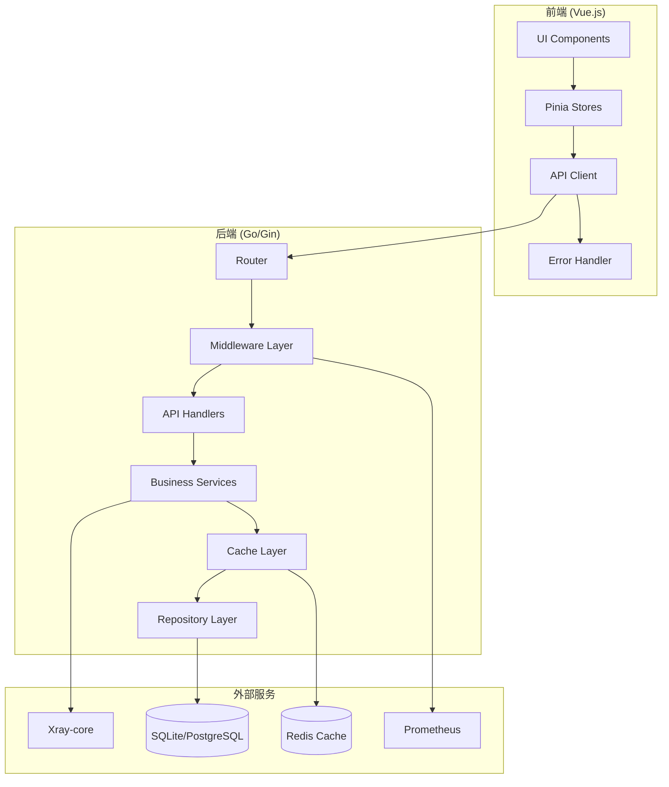
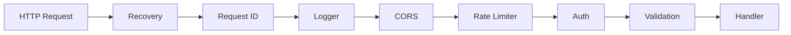
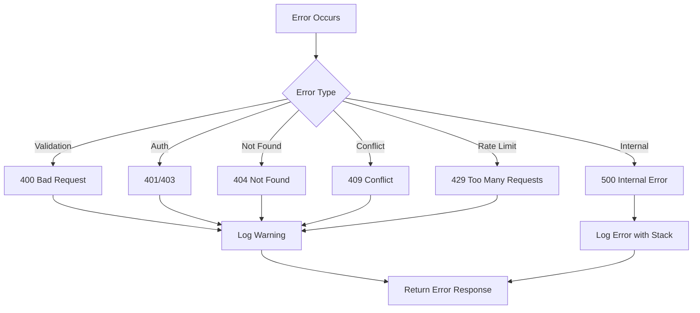

# Design Document: V Panel 项目优化改进

## Overview

本设计文档描述了 V Panel 代理服务器管理面板的全面优化改进方案。V Panel 是一个基于 Go 语言后端和 Vue.js 前端的高性能代理服务器管理系统，支持 VMess、VLESS、Trojan、Shadowsocks 等多种代理协议。

本次优化涵盖以下核心领域：
- 安全性增强（认证、授权、输入验证）
- 错误处理标准化
- 缓存层实现
- 数据库优化
- 前端状态管理和性能优化
- 监控与可观测性
- 账号管理、系统设置、代理服务功能完善

## Architecture

### 系统架构图



### 中间件链



## Components and Interfaces

### 1. 认证服务 (Auth Service)

```go
// AuthService 提供认证和授权功能
type AuthService interface {
    // 用户认证
    Login(ctx context.Context, username, password string) (*TokenPair, error)
    Logout(ctx context.Context, token string) error
    RefreshToken(ctx context.Context, refreshToken string) (*TokenPair, error)
    
    // Token 管理
    GenerateToken(userID int64, username, role string) (string, error)
    ValidateToken(token string) (*Claims, error)
    RevokeToken(ctx context.Context, token string) error
    IsTokenRevoked(ctx context.Context, token string) bool
    
    // 密码管理
    HashPassword(password string) (string, error)
    VerifyPassword(password, hash string) bool
    GenerateTemporaryPassword() string
    
    // 速率限制
    CheckRateLimit(ctx context.Context, ip string) (bool, error)
    RecordLoginAttempt(ctx context.Context, ip string, success bool) error
}

// TokenPair 包含访问令牌和刷新令牌
type TokenPair struct {
    AccessToken  string `json:"access_token"`
    RefreshToken string `json:"refresh_token"`
    ExpiresIn    int64  `json:"expires_in"`
}

// Claims JWT 声明
type Claims struct {
    UserID              int64  `json:"user_id"`
    Username            string `json:"username"`
    Role                string `json:"role"`
    ForcePasswordChange bool   `json:"force_password_change"`
    jwt.RegisteredClaims
}
```

### 2. 缓存层 (Cache Layer)

```go
// CacheService 提供缓存功能
type CacheService interface {
    // 基本操作
    Get(ctx context.Context, key string) ([]byte, error)
    Set(ctx context.Context, key string, value []byte, ttl time.Duration) error
    Delete(ctx context.Context, key string) error
    Exists(ctx context.Context, key string) (bool, error)
    
    // 批量操作
    MGet(ctx context.Context, keys []string) (map[string][]byte, error)
    MSet(ctx context.Context, items map[string][]byte, ttl time.Duration) error
    
    // 缓存失效
    InvalidatePattern(ctx context.Context, pattern string) error
    
    // 健康检查
    Ping(ctx context.Context) error
}

// CacheConfig 缓存配置
type CacheConfig struct {
    Type           string        // "memory" or "redis"
    RedisAddr      string
    RedisPassword  string
    RedisDB        int
    DefaultTTL     time.Duration
    MaxMemoryItems int
}
```

### 3. 错误处理 (Error Handling)

```go
// AppError 应用错误
type AppError struct {
    Code       string                 `json:"code"`
    Message    string                 `json:"message"`
    Details    map[string]interface{} `json:"details,omitempty"`
    HTTPStatus int                    `json:"-"`
    Internal   error                  `json:"-"`
}

// ErrorResponse API 错误响应
type ErrorResponse struct {
    Code      string                 `json:"code"`
    Message   string                 `json:"message"`
    Details   map[string]interface{} `json:"details,omitempty"`
    RequestID string                 `json:"request_id,omitempty"`
    Timestamp string                 `json:"timestamp"`
}

// 错误码常量
const (
    ErrCodeValidation     = "VALIDATION_ERROR"
    ErrCodeUnauthorized   = "UNAUTHORIZED"
    ErrCodeForbidden      = "FORBIDDEN"
    ErrCodeNotFound       = "NOT_FOUND"
    ErrCodeConflict       = "CONFLICT"
    ErrCodeRateLimit      = "RATE_LIMIT_EXCEEDED"
    ErrCodeInternal       = "INTERNAL_ERROR"
    ErrCodeDatabaseError  = "DATABASE_ERROR"
    ErrCodeCacheError     = "CACHE_ERROR"
    ErrCodeXrayError      = "XRAY_ERROR"
)
```

### 4. 用户管理 (User Management)

```go
// UserService 用户服务
type UserService interface {
    // CRUD 操作
    Create(ctx context.Context, req *CreateUserRequest) (*User, error)
    GetByID(ctx context.Context, id int64) (*User, error)
    GetByUsername(ctx context.Context, username string) (*User, error)
    Update(ctx context.Context, id int64, req *UpdateUserRequest) (*User, error)
    Delete(ctx context.Context, id int64) error
    List(ctx context.Context, params *ListParams) (*UserList, error)
    
    // 状态管理
    Enable(ctx context.Context, id int64) error
    Disable(ctx context.Context, id int64) error
    
    // 密码管理
    ChangePassword(ctx context.Context, id int64, oldPass, newPass string) error
    ResetPassword(ctx context.Context, id int64) (string, error)
    
    // 流量管理
    UpdateTrafficUsed(ctx context.Context, id int64, bytes int64) error
    CheckTrafficLimit(ctx context.Context, id int64) (bool, error)
    CheckExpiration(ctx context.Context, id int64) (bool, error)
    
    // 登录历史
    GetLoginHistory(ctx context.Context, id int64, params *ListParams) (*LoginHistoryList, error)
    ClearLoginHistory(ctx context.Context, id int64) error
    RecordLogin(ctx context.Context, id int64, ip, userAgent string, success bool) error
}

// User 用户模型
type User struct {
    ID                  int64     `json:"id"`
    Username            string    `json:"username"`
    Email               string    `json:"email,omitempty"`
    Role                string    `json:"role"`
    Enabled             bool      `json:"enabled"`
    TrafficLimit        int64     `json:"traffic_limit"`
    TrafficUsed         int64     `json:"traffic_used"`
    ExpiresAt           time.Time `json:"expires_at,omitempty"`
    ForcePasswordChange bool      `json:"force_password_change"`
    CreatedAt           time.Time `json:"created_at"`
    UpdatedAt           time.Time `json:"updated_at"`
}
```

### 5. 代理管理 (Proxy Management)

```go
// ProxyService 代理服务
type ProxyService interface {
    // CRUD 操作
    Create(ctx context.Context, userID int64, req *CreateProxyRequest) (*Proxy, error)
    GetByID(ctx context.Context, id int64) (*Proxy, error)
    Update(ctx context.Context, id int64, req *UpdateProxyRequest) (*Proxy, error)
    Delete(ctx context.Context, id int64) error
    List(ctx context.Context, userID int64, params *ListParams) (*ProxyList, error)
    
    // 状态管理
    Start(ctx context.Context, id int64) error
    Stop(ctx context.Context, id int64) error
    Toggle(ctx context.Context, id int64) error
    
    // 批量操作
    EnableAll(ctx context.Context, userID int64) error
    DisableAll(ctx context.Context, userID int64) error
    DeleteBatch(ctx context.Context, ids []int64) error
    
    // 分享链接
    GenerateLink(ctx context.Context, id int64) (string, error)
    
    // 统计
    GetStats(ctx context.Context, id int64) (*ProxyStats, error)
    
    // 端口检查
    CheckPortConflict(ctx context.Context, port int, excludeID int64) (*Proxy, error)
}

// Proxy 代理模型
type Proxy struct {
    ID        int64                  `json:"id"`
    UserID    int64                  `json:"user_id"`
    Name      string                 `json:"name"`
    Protocol  string                 `json:"protocol"`
    Port      int                    `json:"port"`
    Host      string                 `json:"host,omitempty"`
    Settings  map[string]interface{} `json:"settings"`
    Enabled   bool                   `json:"enabled"`
    Running   bool                   `json:"running"`
    Remark    string                 `json:"remark,omitempty"`
    CreatedAt time.Time              `json:"created_at"`
    UpdatedAt time.Time              `json:"updated_at"`
}

// ProxyStats 代理统计
type ProxyStats struct {
    Upload          int64     `json:"upload"`
    Download        int64     `json:"download"`
    Total           int64     `json:"total"`
    ConnectionCount int       `json:"connection_count"`
    LastActive      time.Time `json:"last_active,omitempty"`
}
```

### 6. Xray 管理 (Xray Management)

```go
// XrayManager Xray 管理器
type XrayManager interface {
    // 进程管理
    Start(ctx context.Context) error
    Stop(ctx context.Context) error
    Restart(ctx context.Context) error
    GetStatus(ctx context.Context) (*XrayStatus, error)
    
    // 配置管理
    GetConfig(ctx context.Context) (json.RawMessage, error)
    UpdateConfig(ctx context.Context, config json.RawMessage) error
    ValidateConfig(ctx context.Context, config json.RawMessage) error
    ReloadConfig(ctx context.Context) error
    
    // 版本管理
    GetVersion(ctx context.Context) (*XrayVersion, error)
    Update(ctx context.Context, version string) error
    
    // 代理同步
    SyncProxy(ctx context.Context, proxy *Proxy, action string) error
    GenerateInbound(proxy *Proxy) (json.RawMessage, error)
    
    // 备份恢复
    BackupConfig(ctx context.Context) (string, error)
    RestoreConfig(ctx context.Context, backupPath string) error
}

// XrayStatus Xray 状态
type XrayStatus struct {
    Running     bool      `json:"running"`
    PID         int       `json:"pid,omitempty"`
    Uptime      string    `json:"uptime,omitempty"`
    Version     string    `json:"version"`
    Connections int       `json:"connections"`
    StartedAt   time.Time `json:"started_at,omitempty"`
}

// XrayVersion Xray 版本信息
type XrayVersion struct {
    Current   string `json:"current"`
    Latest    string `json:"latest"`
    CanUpdate bool   `json:"can_update"`
}
```

### 7. 系统设置 (Settings Management)

```go
// SettingsService 设置服务
type SettingsService interface {
    // 获取设置
    Get(ctx context.Context, key string) (string, error)
    GetAll(ctx context.Context) (map[string]string, error)
    GetTyped(ctx context.Context, key string, target interface{}) error
    
    // 更新设置
    Set(ctx context.Context, key, value string) error
    SetMultiple(ctx context.Context, settings map[string]string) error
    
    // 备份恢复
    Backup(ctx context.Context) ([]byte, error)
    Restore(ctx context.Context, data []byte) error
}

// SystemSettings 系统设置
type SystemSettings struct {
    SiteName            string `json:"site_name"`
    SiteDescription     string `json:"site_description"`
    AllowRegistration   bool   `json:"allow_registration"`
    DefaultTrafficLimit int64  `json:"default_traffic_limit"`
    DefaultExpiryDays   int    `json:"default_expiry_days"`
    
    // SMTP 设置
    SMTPHost     string `json:"smtp_host"`
    SMTPPort     int    `json:"smtp_port"`
    SMTPUser     string `json:"smtp_user"`
    SMTPPassword string `json:"-"`
    
    // Telegram 设置
    TelegramBotToken string `json:"-"`
    TelegramChatID   string `json:"telegram_chat_id"`
    
    // 速率限制
    RateLimitEnabled  bool `json:"rate_limit_enabled"`
    RateLimitRequests int  `json:"rate_limit_requests"`
    RateLimitWindow   int  `json:"rate_limit_window"`
}
```

### 8. 角色管理 (Role Management)

```go
// RoleService 角色服务
type RoleService interface {
    // CRUD 操作
    Create(ctx context.Context, req *CreateRoleRequest) (*Role, error)
    GetByID(ctx context.Context, id int64) (*Role, error)
    GetByName(ctx context.Context, name string) (*Role, error)
    Update(ctx context.Context, id int64, req *UpdateRoleRequest) (*Role, error)
    Delete(ctx context.Context, id int64) error
    List(ctx context.Context) ([]*Role, error)
    
    // 权限检查
    HasPermission(ctx context.Context, roleID int64, permission string) bool
    GetPermissions(ctx context.Context, roleID int64) ([]string, error)
    
    // 系统角色
    EnsureSystemRoles(ctx context.Context) error
}

// Role 角色模型
type Role struct {
    ID          int64     `json:"id"`
    Name        string    `json:"name"`
    Description string    `json:"description"`
    Permissions []string  `json:"permissions"`
    IsSystem    bool      `json:"is_system"`
    UserCount   int       `json:"user_count"`
    CreatedAt   time.Time `json:"created_at"`
    UpdatedAt   time.Time `json:"updated_at"`
}
```

### 9. 统计服务 (Statistics Service)

```go
// StatsService 统计服务
type StatsService interface {
    // 仪表盘统计
    GetDashboardStats(ctx context.Context) (*DashboardStats, error)
    
    // 协议统计
    GetProtocolStats(ctx context.Context) ([]*ProtocolStats, error)
    
    // 用户统计
    GetUserStats(ctx context.Context, params *StatsParams) ([]*UserStats, error)
    
    // 流量统计
    GetTrafficStats(ctx context.Context, params *StatsParams) (*TrafficStats, error)
    GetTrafficTimeline(ctx context.Context, params *TimelineParams) ([]*TimelinePoint, error)
    
    // 详细统计
    GetDetailedStats(ctx context.Context, params *StatsParams) (*DetailedStats, error)
}

// DashboardStats 仪表盘统计
type DashboardStats struct {
    TotalUsers      int64 `json:"total_users"`
    ActiveUsers     int64 `json:"active_users"`
    TotalProxies    int64 `json:"total_proxies"`
    ActiveProxies   int64 `json:"active_proxies"`
    TotalTraffic    int64 `json:"total_traffic"`
    UploadTraffic   int64 `json:"upload_traffic"`
    DownloadTraffic int64 `json:"download_traffic"`
    OnlineCount     int   `json:"online_count"`
}
```

### 10. 监控服务 (Monitoring Service)

```go
// MetricsService 指标服务
type MetricsService interface {
    // HTTP 指标
    RecordRequest(method, path string, status int, duration time.Duration)
    RecordError(method, path string, errorCode string)
    
    // 业务指标
    RecordLogin(success bool)
    RecordProxyConnection(protocol string)
    RecordTraffic(upload, download int64)
    
    // 系统指标
    RecordDBQuery(operation string, duration time.Duration)
    RecordCacheHit(hit bool)
    
    // 导出
    Handler() http.Handler
}

// HealthService 健康检查服务
type HealthService interface {
    // 健康检查
    Check(ctx context.Context) *HealthStatus
    CheckDatabase(ctx context.Context) *ComponentHealth
    CheckCache(ctx context.Context) *ComponentHealth
    CheckXray(ctx context.Context) *ComponentHealth
    CheckDiskSpace(ctx context.Context) *ComponentHealth
}

// HealthStatus 健康状态
type HealthStatus struct {
    Status     string                     `json:"status"`
    Timestamp  string                     `json:"timestamp"`
    Components map[string]*ComponentHealth `json:"components"`
}

// ComponentHealth 组件健康状态
type ComponentHealth struct {
    Status  string `json:"status"`
    Message string `json:"message,omitempty"`
    Latency string `json:"latency,omitempty"`
}
```

## Data Models

### 数据库模型

```sql
-- 用户表
CREATE TABLE users (
    id INTEGER PRIMARY KEY AUTOINCREMENT,
    username VARCHAR(50) UNIQUE NOT NULL,
    password_hash VARCHAR(255) NOT NULL,
    email VARCHAR(100),
    role VARCHAR(20) DEFAULT 'user',
    enabled BOOLEAN DEFAULT TRUE,
    traffic_limit BIGINT DEFAULT 0,
    traffic_used BIGINT DEFAULT 0,
    expires_at TIMESTAMP,
    force_password_change BOOLEAN DEFAULT FALSE,
    created_at TIMESTAMP DEFAULT CURRENT_TIMESTAMP,
    updated_at TIMESTAMP DEFAULT CURRENT_TIMESTAMP
);

CREATE INDEX idx_users_username ON users(username);
CREATE INDEX idx_users_email ON users(email);
CREATE INDEX idx_users_role ON users(role);

-- 代理表
CREATE TABLE proxies (
    id INTEGER PRIMARY KEY AUTOINCREMENT,
    user_id INTEGER NOT NULL,
    name VARCHAR(100) NOT NULL,
    protocol VARCHAR(20) NOT NULL,
    port INTEGER NOT NULL,
    host VARCHAR(255),
    settings JSON,
    enabled BOOLEAN DEFAULT TRUE,
    remark VARCHAR(255),
    created_at TIMESTAMP DEFAULT CURRENT_TIMESTAMP,
    updated_at TIMESTAMP DEFAULT CURRENT_TIMESTAMP,
    FOREIGN KEY (user_id) REFERENCES users(id) ON DELETE CASCADE
);

CREATE INDEX idx_proxies_user_id ON proxies(user_id);
CREATE INDEX idx_proxies_protocol ON proxies(protocol);
CREATE INDEX idx_proxies_port ON proxies(port);
CREATE INDEX idx_proxies_user_enabled ON proxies(user_id, enabled);

-- 流量表
CREATE TABLE traffic (
    id INTEGER PRIMARY KEY AUTOINCREMENT,
    user_id INTEGER NOT NULL,
    proxy_id INTEGER,
    upload BIGINT DEFAULT 0,
    download BIGINT DEFAULT 0,
    recorded_at TIMESTAMP NOT NULL,
    created_at TIMESTAMP DEFAULT CURRENT_TIMESTAMP,
    FOREIGN KEY (user_id) REFERENCES users(id) ON DELETE CASCADE,
    FOREIGN KEY (proxy_id) REFERENCES proxies(id) ON DELETE SET NULL
);

CREATE INDEX idx_traffic_user_id ON traffic(user_id);
CREATE INDEX idx_traffic_proxy_id ON traffic(proxy_id);
CREATE INDEX idx_traffic_recorded_at ON traffic(recorded_at);
CREATE INDEX idx_traffic_user_recorded ON traffic(user_id, recorded_at);
CREATE INDEX idx_traffic_proxy_recorded ON traffic(proxy_id, recorded_at);

-- 角色表
CREATE TABLE roles (
    id INTEGER PRIMARY KEY AUTOINCREMENT,
    name VARCHAR(50) UNIQUE NOT NULL,
    description VARCHAR(255),
    permissions JSON,
    is_system BOOLEAN DEFAULT FALSE,
    created_at TIMESTAMP DEFAULT CURRENT_TIMESTAMP,
    updated_at TIMESTAMP DEFAULT CURRENT_TIMESTAMP
);

-- 设置表
CREATE TABLE settings (
    id INTEGER PRIMARY KEY AUTOINCREMENT,
    key VARCHAR(100) UNIQUE NOT NULL,
    value TEXT,
    created_at TIMESTAMP DEFAULT CURRENT_TIMESTAMP,
    updated_at TIMESTAMP DEFAULT CURRENT_TIMESTAMP
);

CREATE INDEX idx_settings_key ON settings(key);

-- 登录历史表
CREATE TABLE login_history (
    id INTEGER PRIMARY KEY AUTOINCREMENT,
    user_id INTEGER NOT NULL,
    ip VARCHAR(50),
    user_agent VARCHAR(255),
    success BOOLEAN,
    created_at TIMESTAMP DEFAULT CURRENT_TIMESTAMP,
    FOREIGN KEY (user_id) REFERENCES users(id) ON DELETE CASCADE
);

CREATE INDEX idx_login_history_user_id ON login_history(user_id);
CREATE INDEX idx_login_history_created_at ON login_history(created_at);

-- Token 黑名单表
CREATE TABLE token_blacklist (
    id INTEGER PRIMARY KEY AUTOINCREMENT,
    token_hash VARCHAR(64) NOT NULL,
    expires_at TIMESTAMP NOT NULL,
    created_at TIMESTAMP DEFAULT CURRENT_TIMESTAMP
);

CREATE INDEX idx_token_blacklist_hash ON token_blacklist(token_hash);
CREATE INDEX idx_token_blacklist_expires ON token_blacklist(expires_at);

-- 审计日志表
CREATE TABLE audit_logs (
    id INTEGER PRIMARY KEY AUTOINCREMENT,
    user_id INTEGER,
    action VARCHAR(50) NOT NULL,
    resource_type VARCHAR(50),
    resource_id INTEGER,
    details JSON,
    ip VARCHAR(50),
    created_at TIMESTAMP DEFAULT CURRENT_TIMESTAMP,
    FOREIGN KEY (user_id) REFERENCES users(id) ON DELETE SET NULL
);

CREATE INDEX idx_audit_logs_user_id ON audit_logs(user_id);
CREATE INDEX idx_audit_logs_action ON audit_logs(action);
CREATE INDEX idx_audit_logs_created_at ON audit_logs(created_at);

-- 迁移版本表
CREATE TABLE migrations (
    id INTEGER PRIMARY KEY AUTOINCREMENT,
    version VARCHAR(50) NOT NULL,
    name VARCHAR(255),
    applied_at TIMESTAMP DEFAULT CURRENT_TIMESTAMP
);
```

### 前端状态模型

```typescript
// 用户状态
interface UserState {
  currentUser: User | null;
  token: string | null;
  refreshToken: string | null;
  isAuthenticated: boolean;
  loading: boolean;
  error: AppError | null;
}

// 代理状态
interface ProxyState {
  proxies: Proxy[];
  currentProxy: Proxy | null;
  total: number;
  loading: boolean;
  error: AppError | null;
  filters: ProxyFilters;
}

// 系统状态
interface SystemState {
  info: SystemInfo | null;
  status: SystemStatus | null;
  stats: DashboardStats | null;
  loading: boolean;
  error: AppError | null;
}

// 设置状态
interface SettingsState {
  settings: SystemSettings | null;
  loading: boolean;
  saving: boolean;
  error: AppError | null;
}

// 通知状态
interface NotificationState {
  notifications: Notification[];
  unreadCount: number;
}

// 错误类型
interface AppError {
  code: string;
  message: string;
  details?: Record<string, any>;
  requestId?: string;
  timestamp: string;
}
```


## Correctness Properties

*A property is a characteristic or behavior that should hold true across all valid executions of a system—essentially, a formal statement about what the system should do. Properties serve as the bridge between human-readable specifications and machine-verifiable correctness guarantees.*

Based on the prework analysis, the following correctness properties have been identified:

### Property 1: Error Response Consistency

*For any* API error response, the response SHALL contain a valid JSON object with fields: `code` (non-empty string), `message` (non-empty string), `timestamp` (valid ISO 8601 format), and optionally `details` (object) and `request_id` (string).

**Validates: Requirements 2.1, 2.2, 2.3, 2.5**

### Property 2: Rate Limiting Enforcement

*For any* IP address making login attempts, after 5 failed attempts within 1 minute, subsequent login attempts SHALL be rejected with a rate limit error until the window expires.

**Validates: Requirements 1.2**

### Property 3: Input Sanitization

*For any* user input containing potentially malicious content (SQL injection, XSS, command injection patterns), the sanitized output SHALL not contain executable code or SQL keywords in dangerous positions.

**Validates: Requirements 1.4**

### Property 4: JWT Secret Validation

*For any* JWT secret configuration, secrets with length less than 32 characters SHALL be rejected during configuration validation.

**Validates: Requirements 1.7**

### Property 5: Token Revocation

*For any* revoked JWT token, subsequent API requests using that token SHALL be rejected with an unauthorized error.

**Validates: Requirements 1.6**

### Property 6: Cache Consistency

*For any* cached data item, after the corresponding database record is updated, the cache entry SHALL be invalidated, and subsequent reads SHALL return the updated data.

**Validates: Requirements 4.1, 4.2, 4.6**

### Property 7: Cache TTL Expiration

*For any* cached item with a configured TTL, after the TTL expires, the cache SHALL return a miss, and the data SHALL be fetched from the database.

**Validates: Requirements 4.3**

### Property 8: User Enable/Disable

*For any* disabled user account, login attempts SHALL be rejected, and *for any* enabled user account with valid credentials, login attempts SHALL succeed.

**Validates: Requirements 17.1, 17.2, 17.3**

### Property 9: User Access Control

*For any* user whose traffic exceeds their limit OR whose account has expired, proxy access SHALL be denied.

**Validates: Requirements 17.9, 17.10**

### Property 10: Email Validation

*For any* email address provided during user creation, the email SHALL match a valid email format pattern, or the creation SHALL be rejected.

**Validates: Requirements 17.14**

### Property 11: Username Uniqueness

*For any* user update attempting to change username to an existing username, the update SHALL be rejected with a conflict error.

**Validates: Requirements 17.15**

### Property 12: Port Conflict Detection

*For any* proxy creation or update with a port that is already in use by another proxy, the operation SHALL be rejected with an error containing the conflicting proxy information.

**Validates: Requirements 21.8, 21.9**

### Property 13: Proxy User Association

*For any* proxy created by a non-admin user, the proxy's user_id SHALL be set to the authenticated user's ID, and *for any* proxy listing by a non-admin user, only proxies belonging to that user SHALL be returned.

**Validates: Requirements 21.2, 21.3**

### Property 14: Xray Configuration Sync

*For any* proxy that is started, the Xray configuration SHALL contain an inbound for that proxy, and *for any* proxy that is stopped or disabled, the Xray configuration SHALL NOT contain an inbound for that proxy.

**Validates: Requirements 21.6, 21.7, 21.13**

### Property 15: Xray Configuration Validation

*For any* Xray configuration update, if the configuration is invalid, the update SHALL be rejected and the previous configuration SHALL remain active.

**Validates: Requirements 22.8**

### Property 16: Xray Configuration Rollback

*For any* Xray configuration reload that fails, the system SHALL automatically rollback to the previous working configuration.

**Validates: Requirements 22.11, 22.12**

### Property 17: System Role Protection

*For any* attempt to delete or modify permissions of a system role (admin, user, viewer), the operation SHALL be rejected with a forbidden error.

**Validates: Requirements 19.4, 19.5**

### Property 18: Role Deletion User Reassignment

*For any* role deletion where users are assigned to that role, all affected users SHALL be reassigned to the default "user" role.

**Validates: Requirements 19.6**

### Property 19: Permission Validation

*For any* role creation or update with invalid permission keys, the operation SHALL be rejected with a validation error.

**Validates: Requirements 19.7**

### Property 20: Statistics Accuracy

*For any* dashboard statistics query, the returned values SHALL match the actual counts and sums from the database (total_users = COUNT(users), total_proxies = COUNT(proxies), total_traffic = SUM(traffic.upload + traffic.download)).

**Validates: Requirements 20.1, 20.2, 20.3, 20.4**

### Property 21: Traffic Period Filtering

*For any* traffic statistics query with a period filter (today, week, month, year), the returned data SHALL only include traffic records within that time period.

**Validates: Requirements 20.7**

### Property 22: Configuration Validation

*For any* application startup with missing required configuration values, the application SHALL fail to start with a clear error message indicating the missing configuration.

**Validates: Requirements 11.1, 11.2**

### Property 23: Database Connection Retry

*For any* database connection failure, the system SHALL retry the connection with exponential backoff, and after successful reconnection, database operations SHALL resume normally.

**Validates: Requirements 15.2**

### Property 24: Slow Query Logging

*For any* database query exceeding the configured threshold (default 200ms), the query SHALL be logged with its duration and SQL statement.

**Validates: Requirements 15.5**

### Property 25: Audit Logging

*For any* sensitive admin operation (user create/update/delete, role modify, settings change), an audit log entry SHALL be created with user_id, action, resource details, IP address, and timestamp.

**Validates: Requirements 1.5**

### Property 26: Login History Recording

*For any* login attempt (successful or failed), a login history record SHALL be created with user_id, IP address, user agent, success status, and timestamp.

**Validates: Requirements 17.12**

### Property 27: Settings Persistence

*For any* settings update, the new values SHALL be persisted to the database, and subsequent reads SHALL return the updated values.

**Validates: Requirements 18.3**

### Property 28: Correlation ID Propagation

*For any* API request, a unique correlation ID SHALL be generated and included in all log entries and error responses related to that request.

**Validates: Requirements 10.3**

### Property 29: Structured Logging Consistency

*For any* log entry, the entry SHALL contain consistent fields: timestamp, level, message, correlation_id, and any additional context fields.

**Validates: Requirements 10.4**

### Property 30: Frontend Error Code Mapping

*For any* API error response received by the frontend, the error code SHALL be mapped to a localized user-friendly message.

**Validates: Requirements 13.7**

### Property 31: Frontend Error ID

*For any* error displayed to the user, the error message SHALL include a unique error ID that can be used for support reference.

**Validates: Requirements 13.10**

### Property 32: Request Debouncing

*For any* search input triggering API requests, multiple rapid inputs within the debounce window SHALL result in only one API request with the final input value.

**Validates: Requirements 8.4**

### Property 33: Data Serialization Round-Trip

*For any* valid proxy settings object, serializing to JSON and deserializing back SHALL produce an equivalent object.

**Validates: Requirements 9.5**

## Error Handling

### Error Categories

| Category | HTTP Status | Error Code | Description |
|----------|-------------|------------|-------------|
| Validation | 400 | VALIDATION_ERROR | Invalid input data |
| Authentication | 401 | UNAUTHORIZED | Missing or invalid credentials |
| Authorization | 403 | FORBIDDEN | Insufficient permissions |
| Not Found | 404 | NOT_FOUND | Resource not found |
| Conflict | 409 | CONFLICT | Resource conflict (duplicate) |
| Rate Limit | 429 | RATE_LIMIT_EXCEEDED | Too many requests |
| Internal | 500 | INTERNAL_ERROR | Server error |
| Database | 500 | DATABASE_ERROR | Database operation failed |
| Cache | 500 | CACHE_ERROR | Cache operation failed |
| Xray | 500 | XRAY_ERROR | Xray operation failed |

### Error Response Format

```json
{
  "code": "VALIDATION_ERROR",
  "message": "Invalid request data",
  "details": {
    "fields": {
      "username": "Username is required",
      "email": "Invalid email format"
    }
  },
  "request_id": "req-abc123",
  "timestamp": "2026-01-11T10:30:00Z"
}
```

### Error Handling Flow



## Testing Strategy

### 测试框架

- **后端单元测试**: Go testing + testify
- **后端属性测试**: gopter (Go Property Testing)
- **后端集成测试**: testcontainers-go
- **前端单元测试**: Vitest
- **前端组件测试**: Vue Test Utils
- **前端 E2E 测试**: Playwright

### 测试覆盖要求

| 类型 | 覆盖率目标 | 说明 |
|------|-----------|------|
| 后端单元测试 | 80% | 所有 handlers, services, repositories |
| 后端属性测试 | 100% properties | 所有 correctness properties |
| 后端集成测试 | 关键路径 | 数据库操作, Xray 集成 |
| 前端单元测试 | 80% | 所有 stores, utils |
| 前端组件测试 | 关键组件 | 表单, 表格, 错误处理 |

### 属性测试配置

```go
// 属性测试配置
var propertyTestConfig = gopter.DefaultTestParameters()
propertyTestConfig.MinSuccessfulTests = 100
propertyTestConfig.MaxSize = 100
```

### 测试标签格式

每个属性测试必须包含以下注释：

```go
// Feature: project-optimization, Property 1: Error Response Consistency
// Validates: Requirements 2.1, 2.2, 2.3, 2.5
func TestErrorResponseConsistency(t *testing.T) {
    // ...
}
```

### 单元测试与属性测试的平衡

- **单元测试**: 用于测试特定示例、边界情况和错误条件
- **属性测试**: 用于验证跨所有输入的通用属性
- 两者互补，共同提供全面的测试覆盖

### 测试示例

```go
// 单元测试示例 - 测试特定边界情况
func TestRateLimiter_ExactlyFiveAttempts(t *testing.T) {
    limiter := NewRateLimiter(5, time.Minute)
    ip := "192.168.1.1"
    
    // 前5次应该允许
    for i := 0; i < 5; i++ {
        allowed, _ := limiter.Allow(ip)
        assert.True(t, allowed, "Attempt %d should be allowed", i+1)
    }
    
    // 第6次应该被拒绝
    allowed, _ := limiter.Allow(ip)
    assert.False(t, allowed, "6th attempt should be rejected")
}

// 属性测试示例 - 测试通用属性
// Feature: project-optimization, Property 2: Rate Limiting Enforcement
// Validates: Requirements 1.2
func TestRateLimiter_Property(t *testing.T) {
    parameters := gopter.DefaultTestParameters()
    parameters.MinSuccessfulTests = 100
    
    properties := gopter.NewProperties(parameters)
    
    properties.Property("After 5 attempts, subsequent attempts are rejected", prop.ForAll(
        func(ip string, attempts int) bool {
            limiter := NewRateLimiter(5, time.Minute)
            
            // 执行 attempts 次尝试
            for i := 0; i < attempts; i++ {
                limiter.Allow(ip)
            }
            
            // 如果尝试次数 >= 5，下一次应该被拒绝
            allowed, _ := limiter.Allow(ip)
            if attempts >= 5 {
                return !allowed
            }
            return allowed
        },
        gen.AlphaString(),
        gen.IntRange(0, 10),
    ))
    
    properties.TestingRun(t)
}
```
