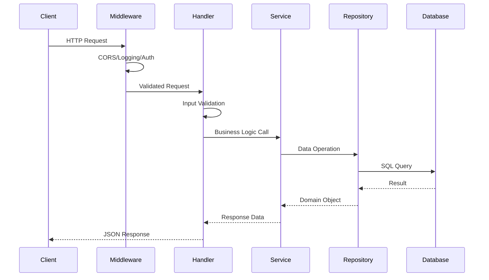

# Design Document: V Panel 项目重构与 Docker 部署

## Overview

本设计文档描述了 V 多协议代理面板项目的重构方案和 Docker 部署架构。重构目标是将当前混乱的项目结构转换为符合 Go 标准项目布局的清晰架构，同时提供完整的 Docker 容器化部署支持。

### 当前问题分析

1. **目录结构混乱**：存在多个功能重叠的目录（如 `db/`、`database/`、`model/`）
2. **重复代码**：多处实现相同功能（如 `api/handlers/` 和 `server/handlers/`）
3. **职责不清**：业务逻辑与 HTTP 处理混合
4. **冗余文件**：根目录存在孤立的 `src/`、`package.json` 等
5. **缺乏容器化支持**：没有 Docker 部署方案

### 重构后目标结构

```
v/
├── cmd/
│   └── v/
│       └── main.go              # 应用入口
├── internal/
│   ├── api/
│   │   ├── handlers/            # HTTP 处理器
│   │   ├── middleware/          # HTTP 中间件
│   │   └── routes.go            # 路由定义
│   ├── auth/                    # 认证模块
│   ├── config/                  # 配置管理
│   ├── database/
│   │   ├── migrations/          # 数据库迁移
│   │   └── repository/          # 数据访问层
│   ├── logger/                  # 日志模块
│   ├── monitor/                 # 系统监控
│   ├── notification/            # 通知服务
│   ├── proxy/
│   │   ├── protocols/           # 协议实现
│   │   │   ├── shadowsocks/
│   │   │   ├── trojan/
│   │   │   ├── vless/
│   │   │   └── vmess/
│   │   └── manager.go           # 代理管理器
│   ├── server/                  # HTTP 服务器
│   └── xray/                    # Xray 管理
├── pkg/
│   ├── errors/                  # 公共错误定义
│   └── utils/                   # 公共工具函数
├── configs/
│   ├── config.yaml.example      # 配置模板
│   └── xray.json.example        # Xray 配置模板
├── deployments/
│   ├── docker/
│   │   ├── Dockerfile
│   │   └── docker-compose.yml
│   └── scripts/
│       ├── build.sh
│       └── entrypoint.sh
├── web/                         # 前端代码（保持不变）
│   ├── src/
│   ├── package.json
│   └── vite.config.js
├── go.mod
├── go.sum
└── README.md
```

## Architecture

### 系统架构图

```mermaid
graph TB
    subgraph "Docker Container"
        subgraph "V Panel Application"
            CMD[cmd/v/main.go]
            
            subgraph "Internal Packages"
                API[internal/api]
                AUTH[internal/auth]
                CONFIG[internal/config]
                DB[internal/database]
                LOGGER[internal/logger]
                MONITOR[internal/monitor]
                PROXY[internal/proxy]
                XRAY[internal/xray]
            end
            
            subgraph "Public Packages"
                ERRORS[pkg/errors]
                UTILS[pkg/utils]
            end
        end
        
        subgraph "Static Files"
            WEB[web/dist]
        end
        
        subgraph "Data Volume"
            DATA[/data]
            SQLITE[(SQLite DB)]
            LOGS[Logs]
            XRAYBIN[Xray Binaries]
        end
    end
    
    CLIENT[Web Browser] --> API
    API --> AUTH
    API --> PROXY
    API --> MONITOR
    AUTH --> DB
    PROXY --> XRAY
    PROXY --> DB
    MONITOR --> DB
    DB --> SQLITE
    LOGGER --> LOGS
    XRAY --> XRAYBIN
    API --> WEB
```

### 请求处理流程



## Components and Interfaces

### 1. 配置管理 (internal/config)

```go
// Config 应用配置结构
type Config struct {
    Server   ServerConfig   `yaml:"server"`
    Database DatabaseConfig `yaml:"database"`
    Auth     AuthConfig     `yaml:"auth"`
    Xray     XrayConfig     `yaml:"xray"`
    Log      LogConfig      `yaml:"log"`
}

type ServerConfig struct {
    Host string `yaml:"host" env:"V_SERVER_HOST" default:"0.0.0.0"`
    Port int    `yaml:"port" env:"V_SERVER_PORT" default:"8080"`
}

type DatabaseConfig struct {
    Path string `yaml:"path" env:"V_DB_PATH" default:"/data/v.db"`
}

type AuthConfig struct {
    JWTSecret     string        `yaml:"jwt_secret" env:"V_JWT_SECRET"`
    TokenExpiry   time.Duration `yaml:"token_expiry" env:"V_TOKEN_EXPIRY" default:"24h"`
    AdminUsername string        `yaml:"admin_username" env:"V_ADMIN_USER" default:"admin"`
    AdminPassword string        `yaml:"admin_password" env:"V_ADMIN_PASS" default:"admin123"`
}

// ConfigLoader 配置加载器接口
type ConfigLoader interface {
    Load() (*Config, error)
    Validate() error
}
```

### 2. 数据库层 (internal/database)

```go
// Repository 通用仓库接口
type Repository[T any] interface {
    Create(ctx context.Context, entity *T) error
    GetByID(ctx context.Context, id int64) (*T, error)
    Update(ctx context.Context, entity *T) error
    Delete(ctx context.Context, id int64) error
    List(ctx context.Context, page, pageSize int) ([]*T, int64, error)
}

// UserRepository 用户仓库接口
type UserRepository interface {
    Repository[User]
    GetByUsername(ctx context.Context, username string) (*User, error)
    GetByEmail(ctx context.Context, email string) (*User, error)
}

// ProxyRepository 代理仓库接口
type ProxyRepository interface {
    Repository[Proxy]
    GetByUserID(ctx context.Context, userID int64) ([]*Proxy, error)
    GetByPort(ctx context.Context, port int) ([]*Proxy, error)
}

// TrafficRepository 流量仓库接口
type TrafficRepository interface {
    Repository[Traffic]
    GetByUserID(ctx context.Context, userID int64) ([]*Traffic, error)
    GetByDateRange(ctx context.Context, userID int64, start, end time.Time) ([]*Traffic, error)
}
```

### 3. 代理协议接口 (internal/proxy)

```go
// Protocol 代理协议接口
type Protocol interface {
    // Name 返回协议名称
    Name() string
    
    // GenerateConfig 生成 Xray 配置
    GenerateConfig(settings *ProxySettings) ([]byte, error)
    
    // GenerateLink 生成分享链接
    GenerateLink(settings *ProxySettings) (string, error)
    
    // ParseLink 解析分享链接
    ParseLink(link string) (*ProxySettings, error)
    
    // Validate 验证配置
    Validate(settings *ProxySettings) error
}

// ProxySettings 代理配置
type ProxySettings struct {
    ID       int64             `json:"id"`
    Name     string            `json:"name"`
    Protocol string            `json:"protocol"`
    Port     int               `json:"port"`
    Settings map[string]any    `json:"settings"`
    Enabled  bool              `json:"enabled"`
}

// ProxyManager 代理管理器
type ProxyManager interface {
    // RegisterProtocol 注册协议
    RegisterProtocol(protocol Protocol)
    
    // CreateProxy 创建代理
    CreateProxy(ctx context.Context, settings *ProxySettings) error
    
    // UpdateProxy 更新代理
    UpdateProxy(ctx context.Context, settings *ProxySettings) error
    
    // DeleteProxy 删除代理
    DeleteProxy(ctx context.Context, id int64) error
    
    // GetProxy 获取代理
    GetProxy(ctx context.Context, id int64) (*ProxySettings, error)
    
    // ListProxies 列出代理
    ListProxies(ctx context.Context, page, pageSize int) ([]*ProxySettings, int64, error)
}
```

### 4. API 层 (internal/api)

```go
// Handler HTTP 处理器基础接口
type Handler interface {
    RegisterRoutes(router *gin.RouterGroup)
}

// AuthHandler 认证处理器
type AuthHandler struct {
    authService auth.Service
    logger      logger.Logger
}

func (h *AuthHandler) RegisterRoutes(router *gin.RouterGroup) {
    auth := router.Group("/auth")
    {
        auth.POST("/login", h.Login)
        auth.POST("/logout", h.Logout)
        auth.GET("/user", h.GetCurrentUser)
    }
}

// ProxyHandler 代理处理器
type ProxyHandler struct {
    proxyManager proxy.ProxyManager
    logger       logger.Logger
}

func (h *ProxyHandler) RegisterRoutes(router *gin.RouterGroup) {
    proxies := router.Group("/proxies")
    {
        proxies.GET("", h.List)
        proxies.POST("", h.Create)
        proxies.GET("/:id", h.Get)
        proxies.PUT("/:id", h.Update)
        proxies.DELETE("/:id", h.Delete)
        proxies.GET("/:id/link", h.GetLink)
    }
}

// SystemHandler 系统处理器
type SystemHandler struct {
    monitor monitor.Monitor
    logger  logger.Logger
}

func (h *SystemHandler) RegisterRoutes(router *gin.RouterGroup) {
    system := router.Group("/system")
    {
        system.GET("/info", h.GetInfo)
        system.GET("/status", h.GetStatus)
    }
}
```

### 5. 日志模块 (internal/logger)

```go
// Logger 日志接口
type Logger interface {
    Debug(msg string, fields ...Field)
    Info(msg string, fields ...Field)
    Warn(msg string, fields ...Field)
    Error(msg string, fields ...Field)
    Fatal(msg string, fields ...Field)
    With(fields ...Field) Logger
}

// Field 日志字段
type Field struct {
    Key   string
    Value any
}

// Config 日志配置
type Config struct {
    Level  string `yaml:"level" env:"V_LOG_LEVEL" default:"info"`
    Format string `yaml:"format" env:"V_LOG_FORMAT" default:"json"`
    Output string `yaml:"output" env:"V_LOG_OUTPUT" default:"stdout"`
}
```

## Data Models

### 用户模型

```go
type User struct {
    ID        int64     `json:"id" gorm:"primaryKey"`
    Username  string    `json:"username" gorm:"uniqueIndex;size:50"`
    Password  string    `json:"-" gorm:"size:255"`
    Email     string    `json:"email" gorm:"uniqueIndex;size:100"`
    Role      string    `json:"role" gorm:"size:20;default:user"`
    IsAdmin   bool      `json:"is_admin" gorm:"default:false"`
    Enabled   bool      `json:"enabled" gorm:"default:true"`
    CreatedAt time.Time `json:"created_at"`
    UpdatedAt time.Time `json:"updated_at"`
}
```

### 代理模型

```go
type Proxy struct {
    ID        int64          `json:"id" gorm:"primaryKey"`
    UserID    int64          `json:"user_id" gorm:"index"`
    Name      string         `json:"name" gorm:"size:100"`
    Protocol  string         `json:"protocol" gorm:"size:20"`
    Port      int            `json:"port" gorm:"index"`
    Settings  datatypes.JSON `json:"settings"`
    Enabled   bool           `json:"enabled" gorm:"default:true"`
    CreatedAt time.Time      `json:"created_at"`
    UpdatedAt time.Time      `json:"updated_at"`
}
```

### 流量统计模型

```go
type Traffic struct {
    ID         int64     `json:"id" gorm:"primaryKey"`
    UserID     int64     `json:"user_id" gorm:"index"`
    ProxyID    int64     `json:"proxy_id" gorm:"index"`
    Upload     int64     `json:"upload"`
    Download   int64     `json:"download"`
    RecordedAt time.Time `json:"recorded_at" gorm:"index"`
}
```

## Correctness Properties

*A property is a characteristic or behavior that should hold true across all valid executions of a system-essentially, a formal statement about what the system should do. Properties serve as the bridge between human-readable specifications and machine-verifiable correctness guarantees.*


Based on the prework analysis, the following properties have been identified as testable:

### Property 1: Configuration Precedence

*For any* configuration key, when both an environment variable (with V_ prefix) and a config file value are set, the environment variable value SHALL take precedence over the config file value, and both SHALL take precedence over default values.

**Validates: Requirements 1.6, 5.1, 5.3**

### Property 2: Database Error Context

*For any* database operation that fails, the returned error SHALL contain contextual information including the operation type and relevant entity identifiers.

**Validates: Requirements 2.4**

### Property 3: API Input Validation

*For any* API request with invalid input data, the Backend SHALL return a 400 Bad Request response with validation error details before any business logic is executed.

**Validates: Requirements 3.5**

### Property 4: Configuration Validation at Startup

*For any* invalid configuration (missing required fields, invalid values), the Backend SHALL fail to start and log a specific error message identifying the invalid configuration.

**Validates: Requirements 5.4**

### Property 5: JSON Log Format

*For any* log message output when running in container mode (V_LOG_FORMAT=json), the output SHALL be valid JSON containing at minimum: timestamp, level, and message fields.

**Validates: Requirements 9.2**

### Property 6: Log Level Filtering

*For any* log message, when a log level is configured (e.g., V_LOG_LEVEL=warn), only messages at or above that level SHALL be output.

**Validates: Requirements 9.3**

### Property 7: Error Logging with Request Context

*For any* error that occurs during request processing, the error log SHALL contain the request ID, HTTP method, path, and error details.

**Validates: Requirements 9.5**

### Property 8: Graceful Shutdown Completion

*For any* in-flight HTTP request when SIGTERM is received, the request SHALL complete successfully before the server terminates, provided it completes within the 30-second timeout.

**Validates: Requirements 10.4**

## Error Handling

### Error Types

```go
package errors

import "fmt"

// ErrorCode 错误码类型
type ErrorCode string

const (
    ErrCodeValidation   ErrorCode = "VALIDATION_ERROR"
    ErrCodeNotFound     ErrorCode = "NOT_FOUND"
    ErrCodeUnauthorized ErrorCode = "UNAUTHORIZED"
    ErrCodeForbidden    ErrorCode = "FORBIDDEN"
    ErrCodeInternal     ErrorCode = "INTERNAL_ERROR"
    ErrCodeDatabase     ErrorCode = "DATABASE_ERROR"
    ErrCodeConfig       ErrorCode = "CONFIG_ERROR"
)

// AppError 应用错误
type AppError struct {
    Code    ErrorCode `json:"code"`
    Message string    `json:"message"`
    Details any       `json:"details,omitempty"`
    Cause   error     `json:"-"`
}

func (e *AppError) Error() string {
    if e.Cause != nil {
        return fmt.Sprintf("%s: %s (caused by: %v)", e.Code, e.Message, e.Cause)
    }
    return fmt.Sprintf("%s: %s", e.Code, e.Message)
}

// NewValidationError 创建验证错误
func NewValidationError(message string, details any) *AppError {
    return &AppError{
        Code:    ErrCodeValidation,
        Message: message,
        Details: details,
    }
}

// NewDatabaseError 创建数据库错误
func NewDatabaseError(operation string, cause error) *AppError {
    return &AppError{
        Code:    ErrCodeDatabase,
        Message: fmt.Sprintf("database operation failed: %s", operation),
        Cause:   cause,
    }
}
```

### HTTP Error Response

```go
// ErrorResponse HTTP 错误响应
type ErrorResponse struct {
    Success bool      `json:"success"`
    Error   *AppError `json:"error"`
}

// HandleError 统一错误处理中间件
func HandleError(c *gin.Context, err error) {
    var appErr *AppError
    if errors.As(err, &appErr) {
        status := mapErrorCodeToStatus(appErr.Code)
        c.JSON(status, ErrorResponse{Success: false, Error: appErr})
        return
    }
    
    // 未知错误
    c.JSON(http.StatusInternalServerError, ErrorResponse{
        Success: false,
        Error: &AppError{
            Code:    ErrCodeInternal,
            Message: "internal server error",
        },
    })
}
```

## Testing Strategy

### Unit Tests

单元测试用于验证各个组件的独立功能：

1. **配置加载测试** - 验证配置文件解析、环境变量覆盖
2. **Repository 测试** - 使用 SQLite 内存数据库测试数据访问
3. **Handler 测试** - 使用 httptest 测试 HTTP 处理器
4. **协议测试** - 验证各协议的配置生成和链接解析

### Property-Based Tests

使用 `github.com/leanovate/gopter` 进行属性测试：

1. **配置优先级测试** - 生成随机配置值，验证优先级规则
2. **输入验证测试** - 生成随机输入，验证验证逻辑
3. **日志格式测试** - 生成随机日志消息，验证 JSON 格式
4. **日志级别测试** - 生成随机日志级别和消息，验证过滤逻辑

### Integration Tests

集成测试验证组件间的交互：

1. **API 端到端测试** - 测试完整的请求-响应流程
2. **数据库集成测试** - 测试实际数据库操作
3. **Docker 构建测试** - 验证 Docker 镜像构建和运行

### Test Configuration

```go
// 属性测试配置
const (
    PropertyTestIterations = 100  // 每个属性测试的迭代次数
)
```

## Docker Deployment Architecture

### Dockerfile 设计

```dockerfile
# Stage 1: Build frontend
FROM node:18-alpine AS frontend-builder
WORKDIR /app/web
COPY web/package*.json ./
RUN npm ci
COPY web/ ./
RUN npm run build

# Stage 2: Build backend
FROM golang:1.23-alpine AS backend-builder
WORKDIR /app
RUN apk add --no-cache gcc musl-dev
COPY go.mod go.sum ./
RUN go mod download
COPY . .
RUN CGO_ENABLED=1 go build -o /app/v ./cmd/v

# Stage 3: Final image
FROM alpine:3.19
RUN apk add --no-cache ca-certificates tzdata
WORKDIR /app
COPY --from=backend-builder /app/v /app/v
COPY --from=frontend-builder /app/web/dist /app/web/dist
COPY configs/config.yaml.example /app/configs/config.yaml

VOLUME ["/data"]
EXPOSE 8080

ENV V_SERVER_HOST=0.0.0.0
ENV V_SERVER_PORT=8080
ENV V_DB_PATH=/data/v.db
ENV V_LOG_FORMAT=json
ENV V_LOG_LEVEL=info

HEALTHCHECK --interval=30s --timeout=3s --start-period=5s --retries=3 \
    CMD wget --no-verbose --tries=1 --spider http://localhost:8080/health || exit 1

ENTRYPOINT ["/app/v"]
```

### Docker Compose 设计

```yaml
version: '3.8'

services:
  v-panel:
    build:
      context: .
      dockerfile: deployments/docker/Dockerfile
    image: v-panel:latest
    container_name: v-panel
    restart: unless-stopped
    ports:
      - "${V_PORT:-8080}:8080"
    volumes:
      - v-data:/data
      - ./configs:/app/configs:ro
    environment:
      - V_SERVER_HOST=0.0.0.0
      - V_SERVER_PORT=8080
      - V_DB_PATH=/data/v.db
      - V_LOG_FORMAT=json
      - V_LOG_LEVEL=${V_LOG_LEVEL:-info}
      - V_JWT_SECRET=${V_JWT_SECRET:-change-me-in-production}
      - V_ADMIN_USER=${V_ADMIN_USER:-admin}
      - V_ADMIN_PASS=${V_ADMIN_PASS:-admin123}
    healthcheck:
      test: ["CMD", "wget", "--no-verbose", "--tries=1", "--spider", "http://localhost:8080/health"]
      interval: 30s
      timeout: 3s
      retries: 3
      start_period: 10s

volumes:
  v-data:
    name: v-panel-data
```

### 环境变量配置

| 变量名 | 描述 | 默认值 |
|--------|------|--------|
| V_SERVER_HOST | 服务器监听地址 | 0.0.0.0 |
| V_SERVER_PORT | 服务器监听端口 | 8080 |
| V_DB_PATH | 数据库文件路径 | /data/v.db |
| V_LOG_FORMAT | 日志格式 (json/text) | json |
| V_LOG_LEVEL | 日志级别 | info |
| V_JWT_SECRET | JWT 签名密钥 | (必须设置) |
| V_ADMIN_USER | 管理员用户名 | admin |
| V_ADMIN_PASS | 管理员密码 | admin123 |
| V_TOKEN_EXPIRY | Token 过期时间 | 24h |

## Migration Plan

### Phase 1: 目录结构重组

1. 创建新目录结构 (`cmd/`, `internal/`, `pkg/`, `configs/`, `deployments/`)
2. 移动入口点到 `cmd/v/main.go`
3. 移动内部包到 `internal/`
4. 移动公共包到 `pkg/`

### Phase 2: 代码合并与清理

1. 合并数据库包到 `internal/database/`
2. 合并 API 处理器到 `internal/api/handlers/`
3. 合并代理协议到 `internal/proxy/protocols/`
4. 删除冗余文件和目录

### Phase 3: Docker 支持

1. 创建 Dockerfile
2. 创建 docker-compose.yml
3. 创建配置模板
4. 创建构建脚本

### Phase 4: 测试与验证

1. 编写单元测试
2. 编写属性测试
3. 验证 Docker 构建
4. 端到端测试
